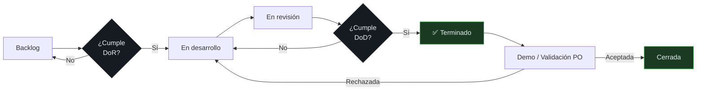

# Convenciones ágiles

> Cómo trabaja el equipo GYMETRA: roles, ceremonias y ciclo de vida de las historias.

---

## 1. Roles

| Rol | Persona | Responsabilidad |
|-----|---------|------------------|
| **Product Owner** | Jhon Jamez Nieto Pérez | Prioriza el backlog, define criterios de aceptación, valida entregables |
| **Desarrollador** | Johan Sebastian Naranjo Quiroga | Creador del proyecto; implementa historias, mantiene documentación y pruebas |
| **Control de Calidad** | Juan Felipe Narváez Amaya | Ejecuta pruebas, valida criterios de aceptación, aprueba la calidad |
| **Asesor Técnico** | Jesús Ariel González Bonilla | Guía de arquitectura, revisión de decisiones,_docente del curso |

> **Creador del proyecto:** Johan Sebastian Naranjo Quiroga inició GYMETRA y es responsable
> de este marco de gobernanza.
>
> Los tres estudiantes comparten la responsabilidad técnica del producto. Ninguna decisión
> de arquitectura queda sin responsable: si el PO prioriza, DEV implementa y QA valida,
> pero la decisión técnica se toma de forma conjunta y se registra en un ADR cuando
> tiene consecuencias de largo plazo.

---

## 2. Ceremonias

| Ceremonia | Frecuencia | Participantes | Objetivo |
|-----------|------------|---------------|----------|
| **Daily** | Diaria, 15 min | DEV + QA | ¿Qué hice? ¿Qué haré? ¿Qué me bloquea? |
| **Planning** | Inicio de sprint | Todo el equipo | Seleccionar HUs del backlog, cierre del sprint anterior |
| **Review / Demo** | Fin de sprint | Todo el equipo + docente | Demostrar lo terminado contra los criterios de aceptación |
| **Retrospectiva** | Fin de sprint | Todo el equipo | Qué mejorar en el proceso |

> **Regla de la demo:** se demuestra lo terminado contra los criterios de aceptación, no
> lo que "más o menos funciona". Una HU incompleta se devuelve al backlog; no se
> presenta a medias.

---

## 3. Ciclo de una Historia de Usuario



Definiciones completas: [`definicion-de-listo.md`](./definicion-de-listo.md) y
[`definicion-de-hecho.md`](./definicion-de-hecho.md).

---

## 4. Anatomía de una Historia de Usuario

```markdown
## HU-XXX — [Título corto]

**Como** [rol/usuario]
**Quiero** [acción]
**Para** [beneficio]

### Criterios de aceptación
| ID | Criterio | Verificable por |
|----|----------|-----------------|
| CA-1 | ... | Prueba unitaria |
| CA-2 | ... | Prueba de integración |

### Fuera de alcance
- ...

### Dependencias
- ...

### Riesgos
- ...
```

Plantilla completa: [`04-requisitos/_plantilla-hu.md`](../04-requisitos/_plantilla-hu.md).

---

## 5. Estimación

| Técnica | Cuándo usarla |
|---------|---------------|
| **Puntos de historia** (Fibonacci: 1, 2, 3, 5, 8, 13) | Casi siempre. Compara complejidad, no horas |
| **Tiempo ideal** | Solo en historias mecánicas (un endpoint CRUD sin lógica) |

### Regla de conversión orientativa

| Puntos | Complejidad | Ejemplo en GYMETRA |
|--------|-------------|-------------------|
| 1 | Trivial | Renombrar un campo en un DTO |
| 2 | Simple | Endpoint CRUD sin validación |
| 3 | Media | Endpoint con validación y manejo de error |
| 5 | Compleja | Integración con un tercero (Stripe, Cognito) |
| 8 | Muy compleja | Flujo que atraviesa varios microservicios |
| 13 | Riesgosa | Cambios de modelo de datos que afectan otros servicios |

> No hay una fórmula de conversión a horas. El objetivo de los puntos es **relativo**:
> comparar historias entre sí, no predecir fechas.

---

## 6. Priorización

El PO ordena el backlog con este criterio, de mayor a menor:

1. **Valor de negocio** — ¿cuántos socios se benefician?
2. **Riesgo técnico** — ¿desbloquea otros trabajos?
3. **Urgencia** — ¿hay una fecha o compromiso externo?
4. **Esfuerzo** — como criterio de desempate, nunca como criterio principal.

> Elegir la historia más fácil porque es la más rápida es la trampa clásica del backlog:
> se entregan muchas historias pequeñas y ninguna que aporte valor real.

---

## 7. Definición de "terminado" vs. "entregado"

| Estado | Significado |
|--------|-------------|
| **Terminado** | Cumple la DoD: código, pruebas, documentación, revisión |
| **Validado** | El PO confirma que cumple los criterios de aceptación en la demo |
| **Entregado** | Está desplegado y verificable por el usuario final |

Una historia puede estar terminada y no entregada si el sprint terminó. No son lo mismo.
