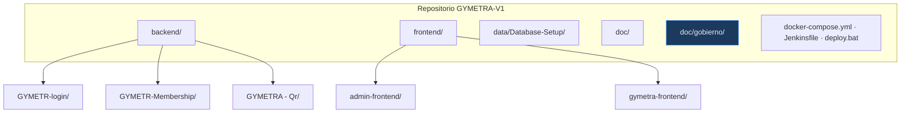

# Convenciones de Git

> Cómo se trabaja con Git en GYMETRA. Estas reglas existen para que el historial sea
> legible y para que cualquiera pueda reconstruir por qué el código está como está.

---

## 1. Ramas

| Rama | Propósito | ¿Se despliega? |
|------|-----------|-----------------|
| `main` | Versión estable y entregable | Sí, a producción |
| `develop` | Integración del trabajo en curso | Sí, a QA |
| `feature/*` | Trabajo en curso de una HU | No |
| `hotfix/*` | Corrección urgente en producción | Sale directo de `main` |

**Ramas actuales del repositorio:** `main`, `aws-cognito`, `develop` (verifica con
`git branch -a` antes de crear ramas nuevas).

### Regla

- **Nunca** se hace commit directo a `main` ni a `develop`.
- Toda rama de trabajo nace de `develop`.
- Un `hotfix/*` nace de `main` y, al fusionarse, se propaga a `develop`.

---

## 2. Ramas de feature

```
feature/HU-[servicio]-[numero]-descripcion-corta
```

| Ejemplo | Significado |
|---------|-------------|
| `feature/HU-AUTH-001-login-cognito` | HU de autenticación, número 001 |
| `feature/HU-MEMB-004-renovacion-membresia` | HU de membresía, número 004 |
| `feature/HU-QR-007-validar-acceso` | HU del servicio QR, número 007 |

Códigos de servicio en uso: `AUTH` (login), `MEMB` (membership), `QR`.

Tipos de rama permitidos:

```
feature/     Nueva funcionalidad
fix/         Corrección de error
chore/       Configuración, dependencias, refactors sin cambio de comportamiento
docs/        Documentación
```

---

## 3. Commits — Conventional Commits

Formato obligatorio:

```
tipo(ámbito): descripción en minúsculas, imperativo, sin punto final

[cuerpo opcional — explica el POR QUÉ, no el qué]

[pie opcional — referencias]
```

### Tipos permitidos

| Tipo | Cuándo usarlo |
|------|---------------|
| `feat` | Nueva funcionalidad |
| `fix` | Corrección de error |
| `refactor` | Mejora de código sin cambio de comportamiento |
| `test` | Alta o mejora de pruebas |
| `docs` | Solo documentación |
| `chore` | Build, CI, dependencias, configuración |
| `perf` | Mejora de rendimiento |

### Ejemplos reales del repositorio

```
feat: implementacion integral de arquitectura AWS Cognito y documentacion DNDA
refactor(frontend): reorganize admin and gymetra modules
docs(config): secure configuration endpoints using environment variables
chore: add .env.example files only (exclude .env.development and .env.production)
```

### Reglas

- **Un commit = una unidad lógica de cambio.** No hacer commit de "wip" ni de "arreglando cosas".
- La descripción va en **minúsculas**, en **imperativo** ("añade", no "añadido" ni "agrega").
- El cuerpo explica **por qué** se hizo el cambio. El diff ya muestra el qué.
- Referencia la HU al final del cuerpo: `Closes #HU-MEMB-004`.

---

## 4. Pull Requests

### Reglas

1. Todo PR se abre contra `develop`, **nunca directamente contra `main`**.
2. El PR se completa entero: título en Conventional Commit, qué cambia, por qué cambia y cómo se
   verificó.
3. Se asigna **al menos un revisor**; lo ideal es el Tech Lead o el dueño del servicio.
4. El pipeline debe estar en **verde**. No se pide revisión con CI fallando.
5. **No** se hace force-push a una rama cuyo PR ya tiene comentarios: se añaden commits.
6. El PR describe el **por qué** del cambio, no el qué.

### Qué bloquea un merge

- Pipeline en rojo (lint, pruebas, build)
- Menos de una aprobación
- Documentación no actualizada (API, modelo de datos, dominio)
- Cobertura de pruebas por debajo del mínimo (ver [`definicion-de-hecho.md`](./definicion-de-hecho.md))

---

## 5. `.gitignore`

El repositorio ya cubre dependencias, builds, IDE, sistema operativo, logs y variables de
entorno. Áreas de mejora detectadas:

| Patrón actual | Problema | Corrección |
|----------------|----------|------------|
| `.env.development.local` | No cubre `.env.development` | Usar `.env.*` con excepción para `.env.example` |
| — | No ignora exports de diagramas generados | Añadir `doc/gobierno/08-uml/diagramas/exportados/*.svg` si se decide versionar solo PNG |
| — | `*.jar` ignora wrappers de Maven | Ya cubierto por `.mvn/wrapper/maven-wrapper.jar` |

---

## 6. Commits y estructura del repositorio



Cada microservicio y cada frontend es un **proyecto independiente** con su propio
`pom.xml` o `package.json` y su propio `.env.example`. No hay un build unificado en la
raíz: el `Jenkinsfile` de la raíz del repositorio construye cada proyecto por separado (no hay
`.github/workflows`). Ver [`10-devops/README.md`](../10-devops/README.md).
