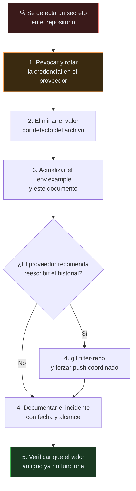

# Política de seguridad y gestión de secretos

> Cómo se manejan los secretos de GYMETRA y qué hacer cuando uno se expone.

## Alcance

Esta política aplica a los cinco despliegues del proyecto (3 microservicios, 2 frontends),
al repositorio Git y a los entornos local, QA y producción.

---

## 1. Inventario de secretos

### Variables de backend

| Variable | Servicio | Consola de origen |
|----------|----------|-------------------|
| `SPRING_DATASOURCE_URL` | los 3 | — |
| `SPRING_DATASOURCE_USERNAME` | los 3 | — |
| `SPRING_DATASOURCE_PASSWORD` | los 3 | PostgreSQL |
| `COGNITO_ISSUER_URI` | los 3 | AWS Cognito |
| `COGNITO_JWKS_URI` | los 3 | AWS Cognito |
| `COGNITO_CLIENT_ID` | los 3 | AWS Cognito |
| `GYMETRA_QR_PORT` | QR | — |
| `GYMETRA_MEMBERSHIP_PORT` | Membership | — |
| `STRIPE_SECRET_KEY` | Membership | Stripe |
| `SPRING_MAIL_HOST` / `_PORT` / `_USERNAME` / `_PASSWORD` | Login, Membership | Gmail |
| `RAPIDAPI_EXERCISE_KEY` / `_HOST` | QR | RapidAPI |
| `SPOONACULAR_API_KEY` | QR | Spoonacular |

### Variables de frontend (expuestas al navegador por diseño)

| Variable | App | Nota |
|----------|-----|------|
| `VITE_API_URL_LOGIN` | ambas | `http://localhost:8080/api` |
| `VITE_API_URL_MEMBERSHIP` | ambas | `http://localhost:8081/api` |
| `VITE_API_URL_QR` | ambas | `http://localhost:8090/api` |
| `VITE_COGNITO_REGION` | ambas | |
| `VITE_COGNITO_USER_POOL_ID` | ambas | |
| `VITE_COGNITO_CLIENT_ID` | ambas | Público del User Pool, sin riesgo |
| `VITE_STRIPE_PUBLIC_KEY` | cliente | Clave **pública** de Stripe, sin riesgo |
| `VITE_SPOONACULAR_API_KEY` | cliente | ⚠️ **No debería estar en el frontend** |

> **Todas las variables `VITE_*` se compilan dentro del bundle JavaScript y son públicas
> por definición.** Cualquier valor `VITE_*` se considera no secreto.
> `VITE_SPOONACULAR_API_KEY` contradice esa regla: expone una clave de terceros al
> navegador. Debe eliminarse del frontend y consumirse únicamente a través del
> servicio QR. Ver hallazgo en
> [`11-calidad/README.md`](../11-calidad/README.md) y
> [R-09 en riesgos](../15-control-proyecto/riesgos.md).

---

## 2. Clasificación

| Nivel | Ejemplos | Regla |
|-------|----------|-------|
| **Público** | `VITE_COGNITO_CLIENT_ID`, `VITE_STRIPE_PUBLIC_KEY`, puertos | Puede estar en el repo |
| **Secreto de terceros** | `RAPIDAPI_EXERCISE_KEY`, `SPOONACULAR_API_KEY`, `STRIPE_SECRET_KEY` | Solo en entorno. **Nunca en el repo** |
| **Secreto de infraestructura** | `SPRING_DATASOURCE_PASSWORD`, claves AWS, `SPRING_MAIL_PASSWORD` | Solo en bóveda. Nunca en el repo |
| **Prohibido en el navegador** | `VITE_SPOONACULAR_API_KEY` | Debe consumirse vía backend |

---

## 3. Reglas del repositorio

### `.gitignore` — estado actual

El `.gitignore` de la raíz cubre correctamente:

```gitignore
.env
.env.local
.env.development.local
.env.test.local
.env.production.local
```

### ⚠️ Hallazgo: `.env.development` versionado

El patrón `.env.development.local` **no** coincide con `.env.development`. Por eso los
archivos `.env.development` de la raíz y de ambos frontends **sí están versionados**:

```
.env.development                              ← versionado
frontend/admin-frontend/.env.development      ← versionado
frontend/gymetra-frontend/.env.development    ← versionado
```

Revisa su contenido antes de decidir: si contienen los valores de ejemplo del
`.env.example` no hay urgencia, pero **deben seguir fuera del repo** por formulación, para
que nadie los complete por costumbre. Si contienen valores reales, es una credencial
expuesta y aplica el procedimiento de la sección 5.

**Corrección recomendada en `.gitignore`:**

```gitignore
# Environment files
.env
.env.*
!.env.example
!.env.*.example
```

### `.env.example` — el contrato de configuración

Cada componente expone su `.env.example` con **todas** las variables que necesita, con
valores de ejemplo locales y sin secretos. Quien configura un entorno nuevo copia de ahí,
no de otro desarrollador.

Estado actual: ✅ los tres backends y los dos frontends tienen `.env.example`.
Ver [`10-devops/configuracion-local.md`](../10-devops/configuracion-local.md).

---

## 4. `docker-compose.yml` — credenciales versionadas

El Compose de la raíz define la base de datos con credenciales fijas:

```yaml
environment:
  - POSTGRES_DB=gymdb
  - POSTGRES_USER=postgres
  - POSTGRES_PASSWORD=123456      # ← versionado
```

Además hay una **desalineación entre el Compose y el servicio `backend`**: el Compose solo
incluye ese servicio (GYMETR-login), que en perfil `prod` usa
`jdbc:postgresql://host.docker.internal:5432` (`application-prod.properties`), por lo que
ignora la variable `DB_HOST=database` que inyecta el Compose y sale hacia el anfitrión en vez
de hacia el servicio `database`. La contraseña de prod (`1234567890`) tampoco coincide con el
`POSTGRES_PASSWORD=123456` del Compose. Por eso la publicación `5000:5432` no la usa el
propio `backend`.

**Regla:** el Compose sirve para desarrollo local, pero **las credenciales se parametrizan**:

```yaml
environment:
  - POSTGRES_DB=${POSTGRES_DB:-gymdb}
  - POSTGRES_USER=${POSTGRES_USER:-postgres}
  - POSTGRES_PASSWORD=${POSTGRES_PASSWORD:?define POSTGRES_PASSWORD}
ports:
  - "${POSTGRES_PORT:-5432}:5432"
```

La sintaxis `:?` hace que `docker compose up` falle si la variable no está definida, en
lugar de arrancar con una contraseña conocida por todo el mundo.

---

## 5. Procedimiento de respuesta a exposición de un secreto



> **El paso 1 es el único que realmente resuelve el problema.** Los pasos 2 a 5 son
> limpieza. Si el secreto se revocó, el hecho de que siga visible en el historial es un
> problema de higiene, no de seguridad.

### Incidentes registrados

#### INC-001 — Claves de RapidAPI y Spoonacular en `application.properties` (2026)

| Campo | Valor |
|-------|-------|
| **Descubierto** | Auditoría documental de `doc/gobierno` |
| **Severidad** | 🔴 Crítica |
| **Ubicación** | `backend/GYMETRA - Qr/src/main/resources/application.properties`, líneas 44 y 49 |
| **Detalle** | `RAPIDAPI_EXERCISE_KEY` y `SPOONACULAR_API_KEY` tienen la clave real como valor por defecto, dentro de un archivo versionado en Git |
| **Impacto** | Cualquier persona con acceso de lectura al repositorio puede abusar de la cuota y la facturación del propietario de la clave |
| **Estado** | ⬜ Abierto — requiere rotación en el proveedor |
| **Responsable** | Equipo de desarrollo |

#### INC-002 — Contraseña de PostgreSQL en `docker-compose.yml` (2026)

| Campo | Valor |
|-------|-------|
| **Severidad** | 🟠 Alta (uso local) |
| **Ubicación** | `docker-compose.yml`, línea 10 |
| **Detalle** | `POSTGRES_PASSWORD=123456` hardcodeada |
| **Mitigación** | Bajo: la base de datos solo se expone en `localhost` y es de desarrollo. Aun así, se parametriza según la sección 4. |
| **Estado** | ⬜ Abierto |

#### INC-003 — Archivos `.env.development` versionados (2026)

| Campo | Valor |
|-------|-------|
| **Severidad** | 🟠 Alta si contienen valores reales |
| **Ubicación** | `.env.development` raíz y de ambos frontends |
| **Detalle** | `.gitignore` no cubre `.env.development`, solo `.env.development.local` |
| **Estado** | ⬜ Abierto — revisar contenido y corregir `.gitignore` |

---

## 6. Checklist antes de un despliegue

- [ ] ¿Ningún secreto tiene valor por defecto en un archivo de configuración?
- [ ] ¿`spring.jpa.show-sql` está en `false` y los loggers de Hibernate en `WARN`?
- [ ] ¿Las variables sensibles vienen del gestor de secretos del entorno, no del repo?
- [ ] ¿El `.env.example` de cada componente lista todas sus variables?
- [ ] ¿La URL de la base de datos del entorno apunta al esquema correcto?
- [ ] ¿Los orígenes CORS están restringidos a los dominios de ese entorno?
- [ ] ¿Se puede confirmar que las credenciales del entorno son de **producción** y no de desarrollo?
