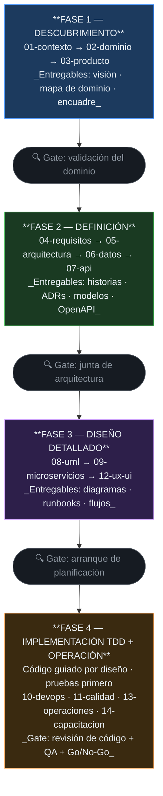

# Guía SDD — Documentación de Diseño de Software

> Este documento explica el **enfoque y la metodología** que gobierna todo `doc/gobierno/`.
> Léelo primero si eres nuevo en el proyecto o en la metodología.

---

## ¿Qué es SDD?

**Software Design Documentation** es un enfoque donde la documentación de diseño
**precede y guía** a la implementación. No se trata de documentar lo que ya se construyó,
sino de diseñar en papel antes de escribir código.

```
Tradicional:  Código  →  Documentación (si alguna vez ocurre)
SDD:          Documentación  →  Código  →  Documentación actualizada
```

### Los 3 principios del SDD

1. **Diseñar antes de codificar:** un documento de diseño revisado y aprobado es
   prerrequisito para empezar a implementar. Si no está documentado, todavía no existe.

2. **Documentación viva:** la documentación se actualiza con cada cambio. Un documento
   desactualizado es técnicamente incorrecto — es código con errores, escrito en prosa.

3. **Trazabilidad:** cada línea de código tiene un requisito que la justifica. Cada
   requisito tiene un caso de prueba. Cada caso de prueba tiene un resultado.

---

## Fases del flujo SDD



### Estado actual de GYMETRA

GYMETRA se encuentra en la **Fase 4**: la documentación de diseño de las fases 1–3 está
completa, los ADR tienen estado *Accepted* y el catálogo de microservicios está redactado.
Persisten brechas operativas, documentadas en
[`15-control-proyecto/riesgos.md`](./15-control-proyecto/riesgos.md).

---

## Orden de llenado recomendado

### Fase 1 — Contexto y dominio ✅ hecho
1. `01-contexto/vision-general.md` — ¿Qué construimos?
2. `01-contexto/alcance.md` — ¿Qué NO construimos?
3. `02-dominio/mapa-de-dominio.md` — ¿Cuáles son los contextos delimitados?
4. `02-dominio/entidades-y-reglas.md` — ¿Qué entidades y reglas existen?
5. `02-dominio/eventos-de-dominio.md` — ¿Qué eventos ocurren?
6. `01-contexto/glosario.md` — Glosario de términos del negocio

### Fase 2 — Producto y requisitos ✅ hecho
7. `03-producto/encuadre-del-problema.md` — Validar el problema
8. `03-producto/vision.md` — Definir la estrella polar
9. `04-requisitos/historias-de-usuario.md` — Historias del MVP
10. `04-requisitos/no-funcionales.md` — RNF con métricas medibles

### Fase 2–3 — Arquitectura ✅ hecho
11. `05-arquitectura/vision-general.md` — Diagrama C4 y lista de servicios
12. `05-arquitectura/decisiones/registros/ADR-00N-*.md` — Decisiones de arquitectura
13. `06-datos/modelo-de-datos.md` — Esquema de datos por servicio
14. `07-api/contratos/openapi/` — Contratos API

### Fase 3 — Diseño detallado ✅ hecho
15. `09-microservicios/catalogo-de-servicios.md` — Catálogo completo
16. `09-microservicios/servicios/NN-[servicio]/` — README + modelo + eventos por servicio
17. `08-uml/diagramas/exportados/` — Diagramas exportados como PNG
18. `12-ux-ui/mapa-de-navegacion.md` — Mapa de navegación de ambas apps

### Fase 4 — TDD y operación ⚠️ parcial
19. `10-devops/configuracion-local.md` — **Hecho y verificado**
20. `11-calidad/estrategia-de-pruebas.md` — Pendiente de elevar (existen 2 tests de contexto)
21. Implementación siguiendo el flujo TDD (ver `11-calidad/guia-tdd.md`)
22. `13-operaciones/observabilidad.md` — Pendiente
23. `14-capacitacion/onboarding-tecnico.md` — Pendiente

---

## Gates de revisión

| Gate | Cuándo | Qué se revisa | Quién aprueba |
|------|--------|---------------|---------------|
| **Revisión de dominio** | Tras `02-dominio/` | ¿Capturamos bien el dominio? | Experto de dominio + Lead técnico |
| **Revisión de arquitectura** | Tras los ADRs y `05-arquitectura/` | ¿La arquitectura satisface los RNF? | Lead técnico + Equipo |
| **Revisión de API** | Antes de implementar cada servicio | ¿El contrato es correcto y consistente? | Consumidores de la API |
| **Demo de sprint** | Al final de cada sprint | ¿El software cumple los criterios de aceptación? | Product Owner |
| **Go/No-Go** | Antes de producción | ¿DoD, DoR y RNF se cumplen? | Lead técnico + PO |

**Roles GYMETRA** (ver [`01-contexto/vision-general.md`](./01-contexto/vision-general.md)):
Jhon Jamez Nieto Pérez (PO) · Johan Sebastian Naranjo Quiroga (DEV, **creador del proyecto**) · Juan Felipe Narváez Amaya (QA)

---

## La regla del documento vivo

```
Si el código cambió pero el documento no  →  El documento está ROTO
Si el documento dice X pero el código hace Y  →  El documento es una MENTIRA
```

**Responsabilidad:** quien abre el PR que cambia el comportamiento del sistema es
responsable de actualizar la documentación correspondiente.

---

## Checklist de verificación de documentación

Antes de dar por terminado un documento, verifica:

- [ ] ¿El contenido refleja el **código real**, no una intención?
- [ ] ¿Los nombres de clases, tablas, endpoints y puertos son **exactos**?
- [ ] ¿Los enlaces internos resuelven?
- [ ] ¿Los diagramas Mermaid se renderizan sin error?
- [ ] ¿Los IDs referenciados (RF-xx, RNF-xx, ADR-00N, HU-xx) **existen**?
- [ ] ¿Los documentos de esta sección están actualizados respecto al cambio?
