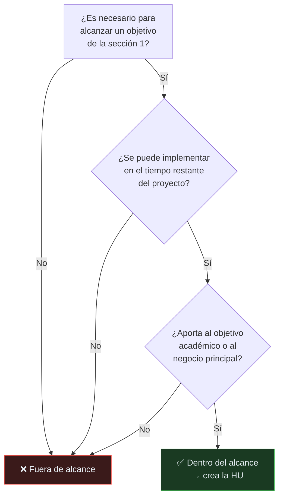

# Alcance del proyecto

> **¿Qué NO hace GYMETRA?** El alcance tan importante como lo que sí hace: define dónde
> termina la responsabilidad del sistema.

## Principio

> Decir que no a algo es tan importante como decir que sí. Un alcance que crece sin
> control es la causa más común de que un proyecto académico no termine a tiempo.

---

## 1. Dentro del alcance

### Gestión de socios
- Registro de nuevos socios con datos personales y foto.
- Autenticación y registro mediante AWS Cognito.
- Asignación de roles: **Admin** y **Client**.
- Edición de perfil (datos personales, teléfono, foto).
- Sincronización de usuarios entre GYMETRA y Cognito.
- Recuperación de contraseña por correo.
- Activación y desactivación de cuentas.

### Planes y membresías
- Catálogo de planes (Mensual, Trimestral, Anual) con precio y duración.
- Cada plan define **beneficios**: acceso a entrenamiento, a nutrición, o ambos.
- Compra de membresía por un socio.
- Estados de la membresía (`UserMembershipStatus`): `ACTIVE`, `SUSPENDED`, `CANCELED`, `EXPIRED`, `PENDING`, `DELETED`. `CANCELED`, `EXPIRED` y `DELETED` son terminales; `DELETED` es la baja lógica que usa `UserMembershipService.deleteUserMembership()`.
- Activación, suspensión y cancelación de membresías por parte del administrador.
- Cálculo de días restantes de una membresía.
- Verificación de permisos derivados del plan (por ejemplo, "¿tiene acceso a nutrición?").

### Pagos
- Creación de intención de pago con Stripe.
- Confirmación de pago.
- Registro histórico de transacciones.
- Métodos: `CASH`, `CARD`, `GATEWAY`.
- Estados: `PENDING`, `CONFIRMED`, `FAILED`.
- Envío de correo de confirmación de pago.

### Control de acceso por QR
- Generación de un código QR único por socio.
- Estado del QR: `active`, `inactive`.
- Registro de entrada y salida por sede.
- Validación de que el socio tiene membresía activa antes de conceder acceso.
- Prevention de doble entrada en el mismo turno.
- Historial de accesos por socio.

### Ejercicio y nutrición
- Catálogo de ~1.300 ejercicios con ilustración animada, muscle group, parte del
  cuerpo y equipo requerido.
- Filtros por parte del cuerpo, músculo objetivo, equipo y nombre.
- Sincronización semanal con ExerciseDB.
- ~500 recetas con calorías, macronutrientes, tiempo de preparación y porciones.
- Generación de planes de alimentación por día o semana.
- Filtros por tipo de dieta (vegetariano, cetogénico, paleo, vegano...).
- Sincronización semanal con Spoonacular.
- Traducción automática de nombres de ejercicios, partes del cuerpo y dietas al español.

### Sedes
- Registro de sedes con nombre, dirección, ciudad y aforo.
- Consulta de sedes para el registro de acceso.

### Métricas
- Visualización de ingresos.
- Visualización de asistencia.
- Reportes administrativos.

### Infraestructura
- Empaquetado de servicios en contenedores Docker.
- Orquestación local con Docker Compose.
- Pipeline de integración y despliegue continuo con Jenkins.
- Configuración por variables de entorno, sin secretos en el código.

---

## 2. Fuera del alcance

| Excluido | Razón |
|----------|--------|
| Nóminas y recursos humanos | No es un sistema de RRHH |
| Contabilidad general y facturación electrónica | Requiere DIAN y software certificado; no es viable en el alcance |
| Pasarelas de pago locales (PSE, Nequi, Bancolombia) | Stripe cubre el objetivo académico de pagos |
| Integración con torniquete físico | Requiere hardware específico; el QR se valida en el punto de ingreso con un dispositivo |
| Machine learning sobre patrones de asistencia | Fuera del objetivo del curso |
| Valoración clínica de salud o nutricional | GYMETRA sugiere planes, no diagnostica |
| App nativa iOS/Android | Ambas apps son web apps con Ionic (empaquetables, pero no publicadas en tiendas) |
| Notificaciones push / SMS | El canal actual es correo electrónico |
| Multi-idioma de la interfaz | La interfaz está en español |
| Modo offline | La app requiere conexión para operar |
| Recuperación de datos de socios eliminados | No existe. `DELETE /api/auth/users/{userId}` borra físicamente la fila (`userRepository.deleteById`) y deja memberships, pagos y accesos huérfanos |
| Auditoría completa de cambios en datos | No hay registro de quién cambió qué y cuándo en las entidades de negocio |

---

## 3. Límites explícitos del diseño actual

Estas decisiones están tomadas y documentadas. Cambiarlas requiere un ADR nuevo.

| Decisión | Documento |
|----------|-----------|
| Los tres servicios comparten una única base de datos `gymdb` | [ADR-002](../05-arquitectura/decisiones/registros/ADR-002-base-datos-compartida.md) |
| No existe API Gateway: cada frontend llama directo a cada servicio por CORS | [ADR-002](../05-arquitectura/decisiones/registros/ADR-002-base-datos-compartida.md) |
| AWS Cognito es el proveedor de identidad único | [ADR-003](../05-arquitectura/decisiones/registros/ADR-003-autenticacion-cognito.md) |
| El servicio QR valida permisos consultando a Membership por HTTP | [ADR-006](../05-arquitectura/decisiones/registros/ADR-006-proxy-validacion-membresia.md) |
| No hay cola de mensajes: la comunicación entre servicios es síncrona | [ADR-002](../05-arquitectura/decisiones/registros/ADR-002-base-datos-compartida.md) |

---

## 4. Cómo determinar si algo está en el alcance

Hazte estas tres preguntas en orden:

> **Regla de desempate:** si dudas, es **fuera de alcance**. Agregar algo fuera de
> alcance se puede hacer con una HU nueva; quitar algo ya construido es costoso.

---

## 5. Control de cambios de alcance

Si una funcionalidad resulta necesaria y no está en el alcance:

1. Escribe una **Historia de Usuario** nueva.
2. El PO la prioriza (ver [`convenciones-agil.md`](../00-gobernanza/convenciones-agil.md)).
3. Si implica una decisión arquitectónica (nuevo servicio, nuevo tercero, cambio de
   modelo), escribe un **ADR** antes de implementar.
4. Actualiza este documento en el mismo PR.
