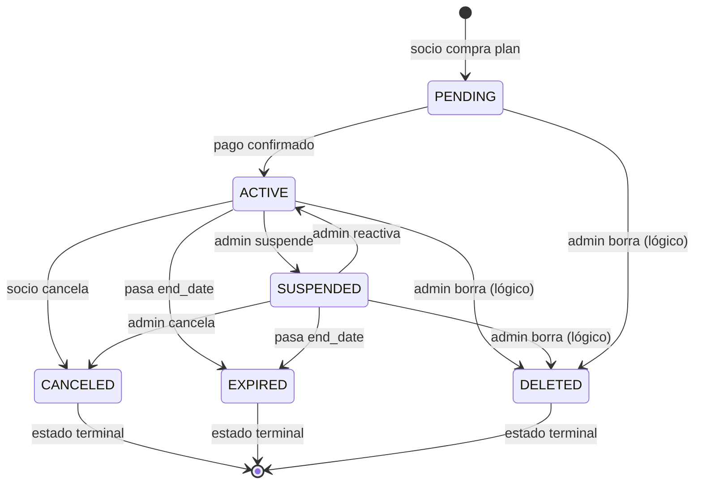

# Glosario de GYMETRA

> **¿Qué significa cada palabra?** Este documento traduce el vocabulario del negocio a
> la entidad técnica que lo representa. Es la fuente de verdad para la terminología.

## Por qué un glosario

En un proyecto donde el negocio habla de "socio" y el código habla de `User`, la
traducción implícita se hace de memoria y cada persona la interpreta distinto. Un glosario
escrito convierte esa traducción en un acuerdo explícito.

> **Regla:** si un término aparece en el negocio pero no en este glosario, agrégalo antes
> de usarlo en código. Si un término existe en el código pero no en el negocio, está mal
> nombrado.

---

## 1. Identidad y acceso

| Término del negocio | Significado | Entidad técnica | Servicio |
|---------------------|-------------|-----------------|----------|
| **Socio** | Persona que asiste al gimnasio y paga una membresía | `User` (tabla `user`) | GYMETR-login |
| **Administrador** | Persona que gestiona el gimnasio | `User` con rol `Admin` | GYMETR-login |
| **Cliente** | Persona registrada en el sistema (cualquier rol) | `User` con rol `Client` | GYMETR-login |
| **Rol** | Conjunto de permisos asignable a un usuario | `Role` (tabla `role`) | GYMETR-login |
| **Credencial** | Contraseña o mecanismo de acceso. GYMETRA **no almacena contraseñas**: las gestiona AWS Cognito | 🔴 `password_hash` (columna vestigial, nunca se escribe) | AWS Cognito |
| **Token de acceso** | Credencial temporal que autoriza llamadas a la API | JWT emitido por AWS Cognito | AWS Cognito |
| **Identidad federada** | Identidad gestionada por un proveedor externo | `cognito_sub` | AWS Cognito |
| **Cuenta desactivada** | Usuario que no puede iniciar sesión | `User.status` ≠ `ACTIVE` | GYMETR-login |
| **Recuperación de contraseña** | Flujo para generar un token temporal de reset | `PasswordResetToken` | GYMETR-login |

> **Nota de nomenclatura:** el código usa `User` para lo que el negocio llama "socio".
> `Socio` se reserva para el término de negocio. La equivalencia es exacta: todo
> `User` es un socio y todo socio es un `User` (administradores incluidos).

---

## 2. Membresías y planes

| Término del negocio | Significado | Entidad técnica | Servicio |
|---------------------|-------------|-----------------|----------|
| **Plan** | Producto que se puede comprar (Mensual, Trimestral, Anual) | `Membership` (tabla `membership`) | GYMETR-Membership |
| **Membresía** | Contrato entre un socio y un plan, con fechas de vigencia | `UserMembership` (tabla `user_membership`) | GYMETR-Membership |
| **Vigencia** | Periodo entre `start_date` y `end_date` | `start_date` / `end_date` | GYMETR-Membership |
| **Días restantes** | Días entre hoy y `end_date` | `GET /api/user-memberships/user/{id}/remaining-days` | GYMETR-Membership |
| **Beneficio / permiso** | Capacidad que otorga el plan (entrenamiento, nutrición) | `Membership.training` / `.nutrition` (booleanos) | GYMETR-Membership |
| **Estado de membresía** | Situación actual de la membresía | `UserMembershipStatus` (enum) | GYMETR-Membership |
| **Activada** | Membresía vigente y en uso | `status = ACTIVE` | GYMETR-Membership |
| **Suspendida** | Membresía pausada temporalmente | `status = SUSPENDED` | GYMETR-Membership |
| **Cancelada** | Membresía terminada por el socio | `status = CANCELED` | GYMETR-Membership |
| **Vencida** | Membresía que superó su `end_date` | `status = EXPIRED` | GYMETR-Membership |
| **Pendiente** | Membresía creada pero aún no activada | `status = PENDING` | GYMETR-Membership |
| **Eliminada** | Socio borrado físicamente; sus datos de negocio quedan huérfanos | `DELETE /api/auth/users/{userId}` | GYMETR-login |

### Estados de membresía

> **Nota:** `UserMembershipStatus` declara **seis** valores: `ACTIVE`, `SUSPENDED`,
> `CANCELED`, `EXPIRED`, `PENDING` y `DELETED`. `CANCELED`, `EXPIRED` y `DELETED` son
> terminales; `DELETED` es la baja lógica que usa `UserMembershipService`.

> **Verificación:** `QrBusinessService.getMembershipStatus()` considera el acceso
> concedido únicamente cuando existe una membresía con `status = ACTIVE`. Los demás
> estados niegan el acceso.

---

## 3. Pagos

| Término del negocio | Significado | Entidad técnica | Servicio |
|---------------------|-------------|-----------------|----------|
| **Pago** | Transacción financiera registrada | `Payment` (tabla `payment`) | GYMETR-Membership |
| **Intención de pago** | Preferencia de cobro creada antes de confirmar | `PaymentIntent` de Stripe | Stripe |
| **Método de pago** | Cómo se pagó | `PaymentMethod`: `CASH`, `CARD`, `GATEWAY` | GYMETR-Membership |
| **Pasarela** | Pago con tarjeta a través de un intermediario | `PaymentMethod = GATEWAY` | GYMETR-Membership |
| **Referencia de transacción** | Identificador de la operación en Stripe | `transaction_reference` | GYMETR-Membership |
| **Pago confirmado** | Transacción completada exitosamente | `PaymentStatus = CONFIRMED` | GYMETR-Membership |
| **Pago fallido** | Transacción rechazada | `PaymentStatus = FAILED` | GYMETR-Membership |
| **Pago pendiente** | Transacción iniciada, sin resultado | `PaymentStatus = PENDING` | GYMETR-Membership |

> **Dato personal:** GYMETRA **no almacena datos de tarjeta**. Stripe los tokeniza. Solo
> se guarda la referencia de la transacción. Ver
> [`política-de-seguridad.md`](../00-gobernanza/politica-de-seguridad.md).

---

## 4. Acceso y sedes

| Término del negocio | Significado | Entidad técnica | Servicio |
|---------------------|-------------|-----------------|----------|
| **Código QR** | Identificador visual único por socio para ingresar | `QrAccess.qr_code` (Base64) | GYMETRA-Qr |
| **QR activo** | Código vigente y válido para ingreso | `QrAccess.status = active` | GYMETRA-Qr |
| **QR inactivo** | Código sin membresía vigente detrás | `QrAccess.status = inactive` | GYMETRA-Qr |
| **Ingreso** | Registro de entrada al gimnasio | `AccessLog` con `entry_time` | GYMETRA-Qr |
| **Salida** | Registro de salida del gimnasio | `AccessLog` con `exit_time` | GYMETRA-Qr |
| **Acceso concedido** | Ingreso autorizado | `AccessLog.result = granted` | GYMETRA-Qr |
| **Acceso denegado** | Ingreso rechazado | `AccessLog.result = denied` | GYMETRA-Qr |
| **Sede** | Instalación física del gimnasio | `Branch` (tabla `branch`) | GYMETRA-Qr |
| **Aforo** | Capacidad máxima de una sede | `Branch.capacity` | GYMETRA-Qr |
| **Turno** | Franja horaria que evita doble entrada | Mañana (06:00–12:00) · Tarde (12:01–22:00) | GYMETRA-Qr |
| **Acceso abierto** | Entrada registrada sin salida posterior | `AccessLog.exit_time IS NULL` | GYMETRA-Qr |

> **Definición de turno:** un socio no puede tener dos ingresos abiertos en el mismo turno
> en la misma sede. Sí puede ingresar de nuevo en el turno siguiente. Implementado en
> `AccessLogBusinessService.isSameShift()`.

> **Nota técnica — QR:** el campo `qr_code` almacena hoy una cadena Base64 de
> `userId:UUID`, no una imagen QR. El renderizado a imagen ocurre en el frontend
> (`qrcode.vue`). Ver R-07 en
> [`riesgos.md`](../15-control-proyecto/riesgos.md).

---

## 5. Ejercicio y nutrición

| Término del negocio | Significado | Entidad técnica | Servicio |
|---------------------|-------------|-----------------|----------|
| **Ejercicio** | Movimiento físico catalogado | `Exercise` (tabla `exercises`) | GYMETRA-Qr |
| **Parte del cuerpo** | Grupo muscular trabajado | `Exercise.body_part` | GYMETRA-Qr |
| **Músculo objetivo** | Músculo principal del ejercicio | `Exercise.target` | GYMETRA-Qr |
| **Equipo** | Implemento requerido | `Exercise.equipment` | GYMETRA-Qr |
| **GIF del ejercicio** | Ilustración animada | `Exercise.gif_data` (binario) | GYMETRA-Qr |
| **Receta** | Plato con información nutricional | `Recipe` (tabla `recipes`) | GYMETRA-Qr |
| **Tipo de dieta** | Régimen alimenticio (vegetariano, keto, paleo) | `Recipe.diet_type` | GYMETRA-Qr |
| **Tipo de plato** | Momento (desayuno, almuerzo, cena) | `Recipe.dish_type` | GYMETRA-Qr |
| **Plan de alimentación** | Conjunto de recetas por día o semana | `GET /api/nutrition/generate` | GYMETRA-Qr |
| **Macronutriente** | Proteína, grasa o carbohidratos | `Recipe.protein` / `.fat` / `.carbs` | GYMETRA-Qr |
| **Traducción automática** | Conversión de términos EN→ES | `TranslationService` | GYMETRA-Qr |

### Distribución calórica del plan de alimentación

| Comida | Porcentaje del objetivo diario |
|--------|-------------------------------|
| Desayuno | 25% |
| Almuerzo | 45% |
| Cena | 30% |

> Implementado en `LocalNutritionService.generateDayPlan()`.

---

## 6. Términos técnicos (se mantienen en inglés)

| Término | Significado |
|---------|-------------|
| **Microservice** | Servicio backend independiente con su propia base de código y despliegue |
| **Endpoint** | URL que expone un método HTTP de un servicio |
| **Commit** | Registro versionado de cambios en Git |
| **PR** (Pull Request) | Propuesta de fusión de una rama |
| **Sprint** | Iteración de trabajo de duración fija |
| **HU** (Historia de Usuario) | Unidad de trabajo con criterios de aceptación |
| **ADR** (Architecture Decision Record) | Registro de una decisión de arquitectura |
| **RNF** (Requisito No Funcional) | Característica de calidad medible |
| **JWT** (JSON Web Token) | Token firmado con la identidad y los roles |
| **CORS** | Mecanismo que permite peticiones entre orígenes distintos |
| **Runbook** | Guía de operación: qué hacer cuando un servicio falla |
| **Deploy** | Despliegue de una versión a un entorno |
| **CI/CD** | Integración y despliegue continuos |

---

## 7. Glosario de datos (equivalencias campo ↔ concepto)

Ver el diccionario completo en
[`06-datos/diccionario-de-datos.md`](../06-datos/diccionario-de-datos.md).

---

## 8. Regla de mantenimiento

| Situación | Acción |
|-----------|--------|
| El negocio usa un término nuevo | Agrégalo aquí **antes** de usarlo en código |
| Un término del código no aparece en el negocio | Renómbralo: el código sigue al negocio |
| Un término tiene dos traducciones en el código | Unifica aquí y corrige el código |
| Un término de terceros cambia de significado | Actualiza y revisa todos los usos en el código |
