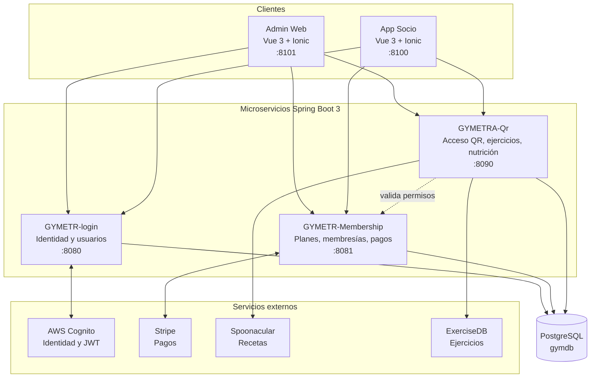

# Visión general de GYMETRA

> **¿Qué construimos y por qué?**

## 1. Descripción

GYMETRA es un **sistema distribuido de gestión de membresías de gimnasio**. Permite a
los administradores gestionar socios, planes, pagos y métricas de negocio, y permite a
los socios comparar su membresía, realizar pagos, generar su código de acceso
QR y consultar rutinas de ejercicio y planes de nutrición.

El nombre GYMETRA es un acrónimo de **GYM**nasio + **ET**nobilidad + **TRA**nsformación.

## 2. Problema que resuelve

Un gimnasio mediano gestiona hoy su operación con procesos que no se hablan entre sí:

| Problema actual | Consecuencia |
|-----------------|--------------|
| Registro de socios en cuaderno o planilla suelta | Datos duplicados, pérdida de historial |
| Control de mensualidades manual | Casos de morosidad sin detectar hasta que el socio llega |
| Control de acceso manual | No hay trazabilidad de quién entró y cuándo |
| Sin datos de asistencia | Imposible tomar decisiones sobre aforo, horarios y retención |
| Ejercicios y nutrición en fuentes externas sueltas | El socio recibe información sin criterio según su plan |

GYMETRA centraliza estas operaciones en un sistema con **trazabilidad completa**: cada
pago, cada acceso y cada cambio de estado de una membresía queda registrado.

## 3. Objetivos del proyecto

### Objetivos principales

1. **Automatizar la gestión de socios** — registro, edición, suspensión y consulta.
2. **Gestionar planes y membresías** — catálogo de planes con vigencia y beneficios.
3. **Procesar pagos** — integración con Stripe para pagos con tarjeta.
4. **Controlar el acceso físico** — códigos QR únicos por socio, validados en el punto de ingreso.
5. **Dar valor al plan** — routines de ejercicio y planes de nutrición según el nivel de membresía.
6. **Proveer métricas** — ingresos y asistencia para la toma de decisiones.

### Objetivos técnicos (del curso)

Además del objetivo de negocio, el proyecto cumple objetivos pedagogicalos:

- Implementar una **arquitectura de microservicios** real, con servicios que se comunican
  por contrato.
- Aplicar **arquitectura hexagonal** (puertos y adaptadores) en los servicios.
- Gestionar **identidad federada** con un proveedor externo (AWS Cognito).
- Integrar **servicios de terceros** (Stripe, Spoonacular, ExerciseDB).
- Operar el sistema con **contenedores** (Docker) y un **pipeline de CI/CD** (Jenkins).
- Practicar **DDD** para modelar el dominio de membresías.

## 4. Alcance resumido

| Dentro del alcance | Fuera del alcance |
|-------------------|-------------------|
| Gestión de socios y roles | Nóminas de personal |
| Planes y membresías con vigencia | Contabilidad general y facturación electrónica |
| Pagos con Stripe | Pasarelas locales (PSE, Nequi, Bancolombia) |
| Control de acceso por QR | Integración con torniquete físico |
| Historial de accesos y métricas | Machine learning sobre patrones de asistencia |
| Rutinas de ejercicio y nutrición | Valoración clínica por profesional de salud |
| Multi-sede (tabla `branch`) | App nativa iOS/Android (es web app con Ionic) |

Detalle completo en [`alcance.md`](./alcance.md).

## 5. Arquitectura en una página

### Los tres microservicios

| Servicio | Puerto | Responsabilidad | Paquete raíz |
|----------|--------|-----------------|---------------|
| **GYMETR-login** | 8080 | Identidad, usuarios, roles, sincronización con Cognito, recuperación de contraseña | `com.login.GYMETRA` |
| **GYMETR-Membership** | 8081 | Planes, membresías de usuario, pagos con Stripe, correos de notificación | `com.Membership.GYMETRA` |
| **GYMETRA-Qr** | 8090 | Códigos QR, registro de accesos, sedes, catálogo de ejercicios, nutrición | `com.GYMETRA.GYMETRA` (subpaquete `qr`) |

Y dos aplicaciones frontend:

| Aplicación | Puerto | Usuario | Base |
|------------|--------|---------|------|
| **admin-frontend** | 8101 | Administrador | Ionic 7 + Vite 4 + Pinia 2 |
| **gymetra-frontend** | 8100 | Socio | Ionic 8 + Vite 5 + Pinia 3 |

Detalle completo en [`09-microservicios/catalogo-de-servicios.md`](../09-microservicios/catalogo-de-servicios.md).

## 6. Stack tecnológico

| Capa | Tecnología | Versión |
|------|-----------|---------|
| Lenguaje backend | Java | 17 |
| Framework backend | Spring Boot | 3.2.0 (login) · 3.5.5 (membership, qr) |
| Persistencia | PostgreSQL | 15 (Docker) |
| ORM | Hibernate / Spring Data JPA | — |
| Seguridad | Spring Security + OAuth2 Resource Server | — |
| Identidad | AWS Cognito User Pool | — |
| Pagos | Stripe Java SDK | 22.19.0 |
| SDK Cognito (login) | amazon-cognito-identityprovider | 2.20.0 |
| Frontend | Vue.js | 3.3+ |
| UI | Ionic | 7 (admin) · 8 (socio) |
| Estado | Pinia | 2 (admin) · 3 (socio) |
| Build frontend | Vite | 4.4.9 (admin) · 5.2.14 (socio) |
| Gráficos (socio) | Chart.js | 4.5.0 |
| Códigos QR (socio) | qrcode.vue | 3.6.0 |
| Pruebas | JUnit, Vitest, Cypress, Playwright | — |
| Contenedores | Docker + Docker Compose | — |
| CI/CD | Jenkins | — |
| API docs | springdoc-openapi (Swagger UI) | 2.7.0 / 2.5.0 |

## 7. Equipo

| Rol | Persona | Responsabilidad principal |
|-----|---------|---------------------------|
| Product Owner | **Jhon Jamez Nieto Pérez** | Priorización, criterios de aceptación, validación de entregables |
| Desarrollador | **Johan Sebastian Naranjo Quiroga** | Creador del proyecto: implementación de microservicios y frontends |
| Control de Calidad | **Juan Felipe Narváez Amaya** | Pruebas, validación de calidad, revisión de entregables |
| Asesor técnico | **Jesús Ariel González Bonilla** | Arquitectura, revisión de decisiones (docente) |

**Creador del proyecto:** Johan Sebastian Naranjo Quiroga.

**Institución:** Corporación Universitaria del Huila
**Curso:** Sistemas Distribuidos — 8° semestre

## 8. Estado actual

| Aspecto | Estado | Nota |
|---------|--------|------|
| Microservicios | ✅ Implementados | 3 servicios, 90 clases Java, 53 endpoints REST |
| Frontends | ✅ Implementados | 2 apps, 11 rutas totales, arquitectura modular por features |
| Base de datos | ✅ Operativa | `gymdb` con 12 tablas: 10 en el script SQL y 2 que crea Hibernate |
| Integraciones | ✅ Operativas | Cognito, Stripe, Spoonacular, ExerciseDB, MyMemory |
| Docker | ⚠️ Parcial | El Compose solo incluye login y gymetra-frontend; faltan Membership y Qr |
| CI/CD | ✅ Configurado | Jenkinsfile con 9 etapas |
| Pruebas | ❌ Insuficientes | 1 test de contexto por servicio; sin pruebas de negocio |
| Documentación | ✅ En construcción | Este marco (`doc/gobierno/`) |

Detalle de brechas en [`15-control-proyecto/riesgos.md`](../15-control-proyecto/riesgos.md).

## 9. Documentos relacionados

- [`alcance.md`](./alcance.md) — límites del proyecto
- [`glosario.md`](./glosario.md) — vocabulario del negocio
- [`02-dominio/mapa-de-dominio.md`](../02-dominio/mapa-de-dominio.md) — contextos delimitados
- [`05-arquitectura/vision-general.md`](../05-arquitectura/vision-general.md) — detalle arquitectónico
