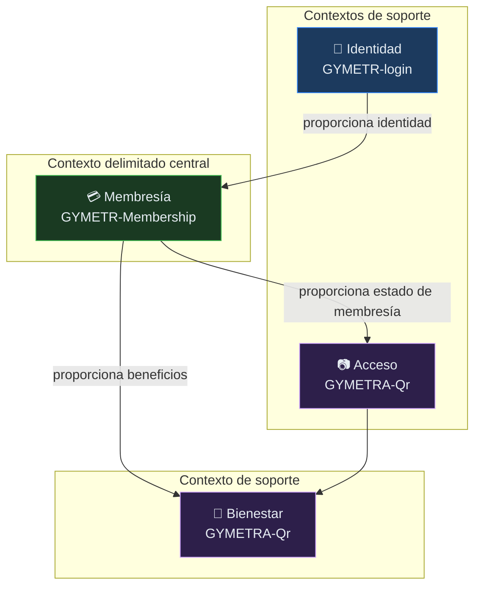

# 02 — Dominio

> **¿Qué es esto?** El modelo de negocio de GYMETRA expresado en el lenguaje del negocio:
> qué entidades existen, qué reglas las gobiernan y qué eventos ocurren.

## Por qué DDD

El modelo de dominio es donde vive el conocimiento del negocio: por qué una membresía
expirada no concede acceso, por qué un socio no puede tener dos ingresos abiertos en el
mismo turno, por qué un plan sin permiso de nutrición no habilita las recetas.

Si ese conocimiento queda repartido en `if` sueltos por los controladores, nadie lo
entenderá después. Si vive en el modelo, se lee, se prueba y se mantiene.

## Enfoque aplicado

GYMETRA usa **DDD estratégico** para separar contextos, y **DDD táctico parcial** dentro
de cada servicio. No se usa Event Sourcing ni CQRS: son patrones que el proyecto no
necesita para su tamaño.

---

## Documentos de esta sección

| Documento | Contenido |
|-----------|-----------|
| [`mapa-de-dominio.md`](./mapa-de-dominio.md) | Contextos delimitados y sus fronteras |
| [`entidades-y-reglas.md`](./entidades-y-reglas.md) | Entidades, value objects, invariantes y reglas de negocio |
| [`eventos-de-dominio.md`](./eventos-de-dominio.md) | Eventos de negocio que ocurren en el sistema |

---

## Contexto delimitado principal

GYMETRA tiene **un contexto delimitado central — Membresía** — y tres contextos de
soporte (Identidad, Acceso, Bienestar) que lo rodean.

---

## Preguntas que esta sección debe responder

- ¿Cuáles son los contextos delimitados y dónde están sus fronteras?
- ¿Qué entidades existen y qué significa cada una?
- ¿Qué reglas de negocio gobiernan cada entidad?
- ¿Qué invariantes no pueden romperse?
- ¿Qué eventos ocurren y quién los produce y consume?
