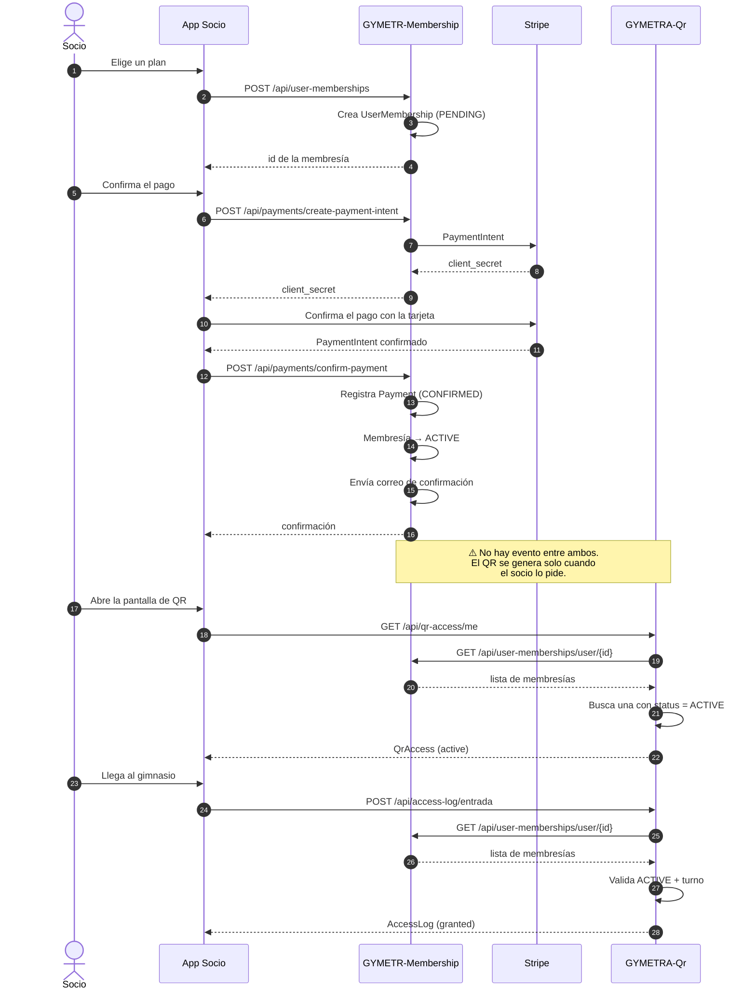
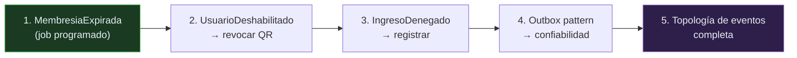

# Eventos de dominio

> Los hechos que ocurren en el negocio de GYMETRA: qué pasa, quién lo produce y quién
> debería enterarse.

## Advertencia importante sobre GYMETRA

> ⚠️ **GYMETRA no implementa arquitectura orientada a eventos.** No hay broker de
> mensajes, ni *outbox pattern*, ni consumidores asíncronos. La comunicación entre
> servicios es **HTTP síncrono punto a punto**, y la "notificación" de que algo cambió se
> resuelve con **re-lectura periódica** (el QR se revalida cada 12 horas).
>
> Los eventos de esta página están modelados desde el **dominio**, no desde la
> implementación. La columna "Estado" distingue lo que existe hoy de lo que existiría con
> mensajería. Documentar la brecha es parte del trabajo: la estrategia de eventos es una
> mejora pendiente, no una decisión tomada.

---

## 1. Eventos del contexto de Identidad

| Evento | Cuándo ocurre | Productor | Consumidores potenciales | Estado |
|--------|---------------|-----------|--------------------------|--------|
| `UsuarioRegistrado` | Un usuario crea su cuenta | `UserService` | Membership (podría crear perfil de socio) | ❌ No implementado |
| `UsuarioActualizado` | Cambian datos o estado de un usuario | `AuthController` | Membership, QR (para invalidar QR) | ❌ No implementado |
| `UsuarioDeshabilitado` | Se desactiva una cuenta | `AuthController` PATCH `/status` | Membership (suspender membresías), QR (revocar QR) | ❌ No implementado |
| `RolAsignado` | Se asigna un rol a un usuario | `RoleService` | — | ❌ No implementado |
| `RolRevocado` | Se quita un rol | `RoleService` | Membership (recalcular permisos) | ❌ No implementado |
| `SincronizacionCognitoCompletada` | Termina la sincronización con Cognito | `CognitoUserSyncService` | — | ⚠️ Síncrono, dentro del request |
| `PasswordRestablecido` | Un socio restablece su contraseña | `AuthController` | — | ❌ No implementado |

> **Riesgo asociado:** si un administrador deshabilita una cuenta, el QR del socio **sigue
> activo** hasta que expire la revalidación de 12 horas, y la membresía sigue `ACTIVE`.
> Ningún evento conecta estas dos acciones hoy. Es el argumento más fuerte a favor de
> adoptar mensajería. Ver R-08 en [`riesgos.md`](../15-control-proyecto/riesgos.md).

---

## 2. Eventos del contexto de Membresía — el núcleo

| Evento | Cuándo ocurre | Productor | Consumidores reales | Estado |
|--------|---------------|-----------|---------------------|--------|
| `MembresiaComprada` | Un socio compra un plan | `UserMembershipService` | QR (emitir QR) | ❌ No implementado — el frontend pide el QR explícitamente |
| `PagoConfirmado` | Stripe confirma el pago | `PaymentService` | QR (activar QR) | ⚠️ Parcial — la activación es por consulta, no por evento |
| `PagoFallido` | Stripe rechaza el pago | `PaymentService` | — | ⚠️ Solo se registra el estado |
| `MembresiaActivada` | Pasa a `ACTIVE` | `UserMembershipService` | QR (activar QR) | ❌ No implementado |
| `MembresiaSuspendida` | Admin suspende | `UserMembershipController` PUT `/suspend` | QR (revocar QR) | ❌ No implementado |
| `MembresiaReactivada` | Admin reactiva | `UserMembershipController` PUT `/activate` | QR (activar QR) | ❌ No implementado |
| `MembresiaCancelada` | Se cancela | `UserMembershipController` PUT `/cancel` | QR (revocar QR) | ❌ No implementado |
| `MembresiaExpirada` | Pasa su `end_date` | ❌ nadie — **no hay tarea programada** | QR (revocar QR) | ❌ No implementado |
| `MembresiaEliminada` | Baja lógica | `UserMembershipService` | — | ❌ No implementado |
| `PlanCreado` / `PlanActualizado` | Cambia el catálogo | `MembershipController` | Frontend (refrescar lista) | ⚠️ Consulta directa |
| `PagoRecibido` (correo) | Se envía el comprobante | `EmailService` | — | ✅ Implementado (correo) |

### El hueco crítico: `MembresiaExpirada`

> 🔴 **No existe ningún proceso que marque una membresía como `EXPIRED`.** No hay tarea
> programada (`@Scheduled`), ni gatillo en la base de datos, ni job externo que revise
> `end_date`.
>
> La consecuencia: una membresía con `end_date` en el pasado **sigue en `ACTIVE`**, y por
> tanto el QR sigue concediendo acceso indefinidamente. El `AccessLog` registra la entrada
> sin problema, porque la única comprobación es `status == ACTIVE`.
>
> Esto es un defecto funcional de la regla de negocio "una membresía vencida no concede
> acceso" y está registrado como **R-06** en
> [`riesgos.md`](../15-control-proyecto/riesgos.md).
> **Corrección esperada:** un `@Scheduled(cron = ...)` en `GYMETR-Membership` que marque
> como `EXPIRED` las membresías con `end_date < hoy AND status = ACTIVE`.

---

## 3. Eventos del contexto de Acceso

| Evento | Cuándo ocurre | Productor | Consumidores | Estado |
|--------|---------------|-----------|--------------|--------|
| `QrGenerado` | Se crea el QR de un socio | `QrBusinessService` | Frontend (mostrar QR) | ✅ Implementado (respuesta HTTP) |
| `QrRevalidado` | Se comprueba la membresía a las 12 h | `QrBusinessService` | — | ✅ Implementado (interno) |
| `QrRevocado` | La membresía deja de estar activa | `QrBusinessService` | Frontend (dejar de mostrar) | ⚠️ Solo se marca `inactive` en la próxima revalidación |
| `IngresoRegistrado` | Un socio entra al gimnasio | `AccessLogBusinessService` | Métricas, admin | ✅ Implementado (registro en BD) |
| `IngresoDenegado` | Se rechaza el acceso | — | Alerta de seguridad | ❌ **No se registra** — la excepción aborta antes |
| `SalidaRegistrada` | Un socio sale | `AccessLogBusinessService` | Métricas (duración) | ✅ Implementado |
| `SedeRegistrada` | Se crea una sede | `BranchController` | Frontend | ✅ Implementado (respuesta HTTP) |

> **Observación sobre `IngresoDenegado`:** cuando la validación falla, el código lanza una
> excepción y **no escribe nada en `access_log`**. Por diseño, la columna `result` existe
> con el valor `denied`, pero **nada en el código lo produce**: el campo solo almacena
> `granted`. Esto significa que **no hay registro de los intentos de acceso denegados**,
> que es justamente el dato con más valor para detectar un abuso de un QR robado.
> Registrado como R-14 en [`riesgos.md`](../15-control-proyecto/riesgos.md).

---

## 4. Eventos del contexto de Bienestar

| Evento | Cuándo ocurre | Productor | Consumidores | Estado |
|--------|---------------|-----------|--------------|--------|
| `EjerciciosSincronizados` | Termina la carga de ExerciseDB | `ExerciseSyncService` | — | ⚠️ Solo log |
| `EjerciciosResincronizados` | `POST /sync/force` o `clear-and-force` | `ExerciseController` | Frontend | ✅ Implementado |
| `RecetasSincronizadas` | Termina la carga de Spoonacular | `NutritionSyncService` | — | ⚠️ Solo log |
| `PlanNutricionalGenerado` | Un socio solicita un plan | `LocalNutritionService` | Frontend | ✅ Implementado (respuesta HTTP) |

---

## 5. Diagrama de flujo de eventos del núcleo

---

## 6. Lo que la mensajería resolvería

Si GYMETRA adoptara una cola de mensajes, estos cinco problemas desaparecen:

| Problema actual | Cómo lo resuelve un evento |
|-----------------|---------------------------|
| Deshabilitar un usuario no revoca su QR | `UsuarioDeshabilitado` → QR revoca el código |
| Una membresía vencida sigue concediendo acceso | `MembresiaExpirada` → QR revoca, en vez de esperar 12 h |
| No hay registro de accesos denegados | `IngresoDenegado` se publica y se persiste |
| Cambiar un plan no notifica a los QTFs | `PlanActualizado` → frontend invalida caché |
| El frontend coordina un flujo de 4 pasos | Cada servicio reacciona a su evento |

### Orden de adopción recomendado

> Los pasos 1 a 3 **no requieren** mensajería: se resuelven con un `@Scheduled` y una
> llamada HTTP interna. Son la relación costo/beneficio más favorable del proyecto. El
> paso 4 sí justifica adoptar un broker.

---

## 7. Documentos relacionados

- [`entidades-y-reglas.md`](./entidades-y-reglas.md) — reglas que disparan estos eventos
- [`09-microservicios/catalogo-de-eventos.md`](../09-microservicios/patrones-de-comunicacion.md) — vista por servicio
- [`09-microservicios/mapa-de-dependencias.md`](../09-microservicios/catalogo-de-servicios.md) — dependencias síncronas actuales
- [`15-control-proyecto/backlog-tecnico.md`](../15-control-proyecto/README.md) — deuda técnica priorizada
