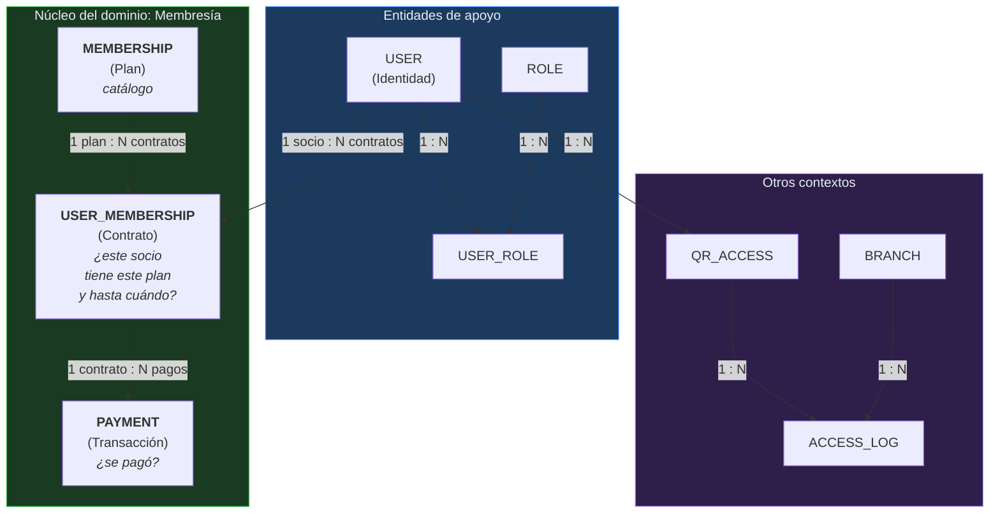

# Mapa del dominio

> Contextos delimitados, sus fronteras y cómo se comunican.

## 1. El problema del modelo

El modelo de GYMETRA tiene dos conceptos que se parecen pero **no son lo mismo**:

- Una **persona** que existe en el sistema.
- Un **socio** que tiene una membresía vigente.

Confundirlos lleva a dos errores frecuentes:

1. Tratarla como la misma cosa, y no poder tener usuarios que aún no son socios
   (un admin recién registrado no tiene membresía).
2. Tratarlas como entidades distintas sin relación, y perder la trazabilidad de quién pagó
   qué.

GYMETRA las modela como **una sola entidad `User`** más una relación opcional
`UserMembership`. El `userId` viaja siempre como referencia, nunca como copia.

---

## 2. Contextos delimitados

| Contexto | Servicio | Responsabilidad | Modelo de datos |
|----------|----------|------------------|-----------------|
| **Identidad** | GYMETR-login | Quién es el usuario, qué roles tiene, autenticación | `user`, `role`, `user_role`, `password_reset_token` |
| **Membresía** | GYMETR-Membership | Planes, contratos de membresía, pagos | `membership`, `user_membership`, `payment` |
| **Acceso** | GYMETRA-Qr | Credencial de ingreso físico y trazabilidad | `qr_access`, `access_log`, `branch` |
| **Bienestar** | GYMETRA-Qr | Ejercicios y nutrición como contenido de valor del plan | `exercises`, `recipes` |
| **Proveedor de identidad** | AWS Cognito | Emisión y validación de tokens | externo |

> **Dos contextos en un solo servicio:** Acceso y Bienestar comparten el servicio
> `GYMETRA-Qr` porque comparten tecnología, base de datos y despliegue, y no se comunican
> entre sí más allá de la UI. Si el proyecto creciera, serían candidatos a separarse.

---

## 3. Mapa de contextos

```mermaid
graph TB
    subgraph CON["Contexto de Identidad"]
        direction TB
        UC1["Gestionar usuarios"]
        UC2["Gestionar roles"]
        UC3["Autenticar"]
        UC4["Sincronizar con Cognito"]
    end

    subgraph CM["Contexto de Membresía · NÚCLEO"]
        direction TB
        UC5["Gestionar planes"]
        UC6["Gestionar membresías"]
        UC7["Procesar pagos"]
        UC8["Verificar permisos"]
    end

    subgraph CA["Contexto de Acceso"]
        direction TB
        UC9["Emitir QR"]
        UC10["Validar ingreso"]
        UC11["Registrar entrada/salida"]
        UC12["Gestionar sedes"]
    end

    subgraph CB["Contexto de Bienestar"]
        direction TB
        UC13["Consultar ejercicios"]
        UC14["Consultar nutrición"]
    end

    EXT1["💳 Stripe"]
    EXT2["🥗 Spoonacular"]
    EXT3["💪 ExerciseDB"]

    CON -->|"User( id, email, roles )"| CM
    CM -->|"membresía activa"| CA
    CM -->|"beneficios del plan"| CB
    CM <--> EXT1
    CB <--> EXT2
    CB <--> EXT3
    CA --> CM : "consulta estado"

    style CM fill:#1a3a22,stroke:#3fb950,color:#e6edf3
    style CON fill:#1c3a5e,stroke:#388bfd,color:#e6edf3
    style CA fill:#2d1f4a,stroke:#d2a8ff,color:#e6edf3
    style CB fill:#2d1f4a,stroke:#d2a8ff,color:#e6edf3
```

---

## 4. Fronteras y contratos entre contextos

### Identidad → Membresía

| Aspecto | Detalle |
|---------|---------|
| **Qué comparte** | Solo el `userId` (numérico) |
| **Cómo se comunica** | `userId` pasado explícitamente en el path de la URL |
| **Qué NO comparte** | La tabla `user` **no** tiene claves foráneas hacia otras tablas. Cada servicio tiene su propia lectura. |
| **Riesgo** | Un `userId` que no existe en Identidad produce un error en tiempo de ejecución, no en validación. |

> **Acoplamiento deliberado:** el servicio `GYMETRA-Qr` mantiene una entidad `UserMin`
> que mapea la tabla `user` con **solo tres campos** (`user_id`, `cognito_sub`, `email`).
> Es una proyección deliberada, no una entidad completa. Ver la nota de propiedad de
> datos en [`matriz-de-propiedad-de-datos.md`](../09-microservicios/reglas-de-frontera.md).

### Membresía → Acceso

| Aspecto | Detalle |
|---------|---------|
| **Qué comparte** | `userId` y la decisión "¿tiene membresía activa?" |
| **Cómo se comunican** | HTTP síncrono. `GYMETRA-Qr` consulta a `GYMETR-Membership` |
| **Frecuencia** | En la generación del QR y en cada registro de acceso |
| **Acoplamiento** | Servicio a servicio, por HTTP. Sin cola de mensajes. |

Dos endpoints de Membership actúan como API para QR:

| Endpoint | Propósito | Notas |
|----------|-----------|-------|
| `GET /api/user-memberships/user/{userId}` | Lista las membresías de un socio | `GYMETRA-Qr` busca una con `status = ACTIVE`. **No** está en `permitAll()`: exige JWT, y QR la llama sin token, así que responde 401 — ver R-28 en [riesgos](../15-control-proyecto/riesgos.md) |
| `GET /api/user-memberships/user/{userId}/permission/{permiso}` | ¿Tiene el beneficio? | **Sí** está en `permitAll()`, junto con `GET /api/memberships/available` — ver R-08 en [riesgos](../15-control-proyecto/riesgos.md) |

> **Fragilidad documentada:** `QrBusinessService.getMembershipStatus()` asume que la
> respuesta es un **array** de objetos con campo `status`. Si Membership cambia la forma
> de la respuesta, QR deja de validar accesos y **falla en silencio** (devuelve `false`).
> Está registrado como R-06 en [riesgos](../15-control-proyecto/riesgos.md).

### Membresía → Bienestar

| Aspecto | Detalle |
|---------|---------|
| **Qué comparte** | La decisión "¿el plan incluye este beneficio?" |
| **Cómo se comunican** | **No hay comunicación directa.** El frontend consulta los beneficios al servicio de Membresía y luego al de Bienestar. |
| **Consecuencia** | Un usuario sin permiso de nutrición ve los botones de nutrición, pero la API devuelve vacío. La restricción es de UI, no de servidor. |

---

## 5. Modelo de dominio del núcleo: Membresía



### Entidades del núcleo

| Entidad | Tipo | Significado | Servicio propietario |
|---------|------|-------------|---------------------|
| `Membership` | **Entidad raíz** (catálogo) | El producto que se puede comprar | GYMETR-Membership |
| `UserMembership` | **Entidad raíz** | El contrato entre socio y plan, con vigencia y estado | GYMETR-Membership |
| `Payment` | Entidad dependiente | La transacción que sustenta un contrato | GYMETR-Membership |

> `Membership` y `UserMembership` son raíces de agregado **independientes**: un plan
> existe sin que nadie lo haya comprado, y una membresía no es un plan. El primero es
> catálogo; el segundo es un hecho consumado.

---

## 6. Fronteras de contexto vs. límites de servicio

| Contexto | Servicio | ¿Coinciden? |
|----------|----------|-------------|
| Identidad | GYMETR-login | ✅ Sí, 1:1 |
| Membresía | GYMETR-Membership | ✅ Sí, 1:1 |
| Acceso | GYMETRA-Qr | ⚠️ Parcial |
| Bienestar | GYMETRA-Qr | ⚠️ Parcial |

Acceso y Bienestar viven en el mismo servicio **por conveniencia técnica**, no porque sean
el mismo contexto. Están separados en el modelo y no comparten entidades.

---

## 7. Lenguema ubicuo

| Término ubiquitous | Dónde vive |
|--------------------|------------|
| **Socio** / `User` | Contexto de Identidad |
| **Plan** / `Membership` | Contexto de Membresía |
| **Membresía** / `UserMembership` | Contexto de Membresía |
| **Pago** / `Payment` | Contexto de Membresía |
| **Beneficio** / `training`, `nutrition` | Contexto de Membresía |
| **Código QR** / `QrAccess` | Contexto de Acceso |
| **Ingreso** / `AccessLog` | Contexto de Acceso |
| **Sede** / `Branch` | Contexto de Acceso |
| **Ejercicio** / `Exercise` | Contexto de Bienestar |
| **Receta** / `Recipe` | Contexto de Bienestar |

> **Regla:** el mismo término no puede tener dos significados en el sistema. Si aparece un
> cuarto sentido, es un término nuevo: agrégalo al
> [glosario](../01-contexto/glosario.md) antes de usarlo.

---

## 8. Documentos relacionados

- [`entidades-y-reglas.md`](./entidades-y-reglas.md) — invariantes y reglas
- [`eventos-de-dominio.md`](./eventos-de-dominio.md) — hechos del dominio
- [`06-datos/modelo-de-datos.md`](../06-datos/modelo-de-datos.md) — entidades en la base de datos
- [`05-arquitectura/decisiones/registros/ADR-002-base-datos-compartida.md`](../05-arquitectura/decisiones/registros/ADR-002-base-datos-compartida.md) — decisión de base compartida
