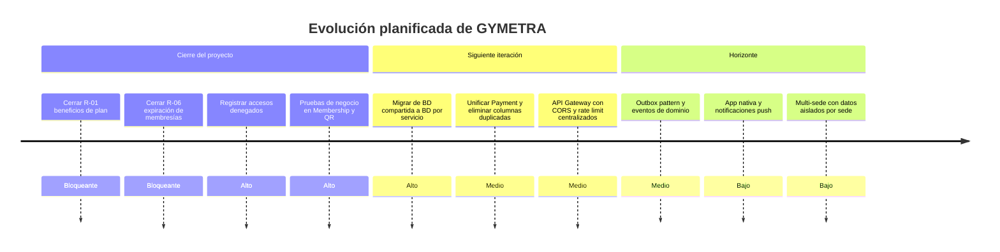

# Visión de producto

> **¿Hacia dónde va GYMETRA?** La dirección del producto, los principios que no
> negociamos y cómo medimos el progreso.

---

## 1. Estrella polar

> **Que el socio entre al gimnasio sin friction, y que el administrador sepa al instante
> quién es cada socio, cuánto paga y si puede entrar.**

Todo lo que se construya en GYMETRA tiene que servir a esa frase. Si una funcionalidad no
la sirve, no entra en el alcance.

---

## 2. Principios del producto

| # | Principio | Qué significa en la práctica |
|---|-----------|------------------------------|
| 1 | **El acceso nunca se discute** | El código QR es la fuente de verdad. Si el sistema dice activo, entra. |
| 2 | **La información pertenece al usuario** | Cada socio ve su membresía, sus pagos y sus accesos sin pedirle permiso a nadie. |
| 3 | **El administrador decide, el sistema ejecuta** | Suspender, reactivar, cancelar o cambiar precios es una decisión suya, no una consecuencia del sistema. |
| 4 | **El plan debe entregar lo que promete** | Si el plan dice que incluye nutrición, la funcionalidad de nutrición tiene que funcionar. |
| 5 | **Sin filas, sin fricción** | La puerta es el momento de mayor tensión del día del socio. Nada de formularios. |
| 6 | **Los datos del socio no se negocian** | Protección de datos personales como restricción de diseño, no como añadido. |

> El principio 4 es exactamente lo que R-01 incumple hoy. Documentar el principio sin
> señalar su violación sería documentar ficción.

---

## 3. Propuesta de valor por segmento

| Segmento | Dolor | Valor de GYMETRA | Funcionalidad que lo entrega |
|----------|-------|------------------|----------------------------|
| **Socio** | Verifica su acceso verbalmente | Su QR es su credencial | QR + verificación de membresía |
| **Socio premium** | El plan no se distingue en la práctica | Ejercicios y nutrición según su plan | `training` / `nutrition` (⚠️ ver R-01) |
| **Administrador** | Planillas y control manual | Gestión de socios, membresías y pagos en una pantalla | Módulos de usuarios, membresías y pagos |
| **Dueño** | Decide a ciegas | Ingresos y asistencia en un dashboard | Métricas con Chart.js |

---

## 4. Métricas del producto

### Prioridad 1 — instrumentar primero

Estas tres se eligen porque ninguna funciona hoy y las tres desbloquean decisiones.

| Métrica | Fuente de datos | Bloqueo actual | Acción |
|---------|-----------------|----------------|--------|
| **Accesos concedidos vs. denegados** | `access_log.result` | Solo se registra `granted` | Registrar también los denegados (R-14) |
| **Membresías vencidas** | `user_membership.status` | Nadie marca `EXPIRED` | Job programado diario (R-06) |
| **Uso de beneficios** | Nuevo evento de lectura | No se registra la consulta | Instrumentar la lectura de rutinas y nutrición |

### Prioridad 2 — medibles con lo que ya existe

| Métrica | Consulta |
|---------|----------|
| Ingresos del mes | `SUM(payment.amount) WHERE paymentStatus='CONFIRMED' GROUP BY month(paymentDate)` |
| Tasa de renovación | `COUNT(ACTIVE) / COUNT(ACTIVE, CANCELED, EXPIRED)` |
| Asistencia por socio | `COUNT(access_log) GROUP BY user_id` |
| Ocupación por sede | `COUNT(access_log) GROUP BY branch_id / branch.capacity` |
| Distribución por método de pago | `COUNT(payment) GROUP BY paymentMethod` |
| Distribución de uso de PX | Uso de ejercicios y recetas ya sincronizados |

---

## 5. Roadmap

> **Principio de priorización:** lo que desbloquea medición y lo que incumple un principio
> del producto va primero. R-01 va primero porque el principio 4 lo exige; R-06 porque sin
> él el principio 1 es falso.

---

## 6. Fuera del producto

Ver [`../01-contexto/alcance.md`](../01-contexto/alcance.md) para la lista completa de lo
excluido. Lo esencial:

- No es un sistema de gestión de personal ni de nómina.
- No es un sistema contable ni de facturación electrónica.
- No es una app de salud ni de valoración clínica.
- No es un marketplace de servicios de gimnasio.
- No es multiplataforma nativo: es web app con envoltura de Ionic.

---

## 7. Anti-patrones de producto a evitar

| Anti-patrón | Por qué lo evitamos |
|-------------|---------------------|
| Que el QR se pueda reutilizar Unlimited veces por el mismo turno | Ya está resuelto con la regla de turno (R-ACC-2) |
| Que el admin vea datos que el socio no puede ver | Principio de mínimo privilegio |
| Que eliminar un socio borre su historial de pagos y accesos | Hoy `DELETE` borra la fila en cascada y deja datos huérfanos; lo contrario sería más difícil de auditar |
| Que un plan "básico" no tenga ninguna diferencia real | Un plan sin beneficios es un descuento, no un producto |
| Que el sistema decida a quién se le niego el acceso sin intervención humana | El sistema informa; la decisión final es del operador del gimnasio |

---

## 8. Documentos relacionados

- [`encuadre-del-problema.md`](./encuadre-del-problema.md) — el problema y las hipótesis
- [`../04-requisitos/no-funcionales.md`](../04-requisitos/no-funcionales.md) — atributos de calidad
- [`../02-dominio/eventos-de-dominio.md`](../02-dominio/eventos-de-dominio.md) — eventos que la estrategia necesita
- [`../15-control-proyecto/riesgos.md`](../15-control-proyecto/riesgos.md) — riesgos que bloquean objetivos
