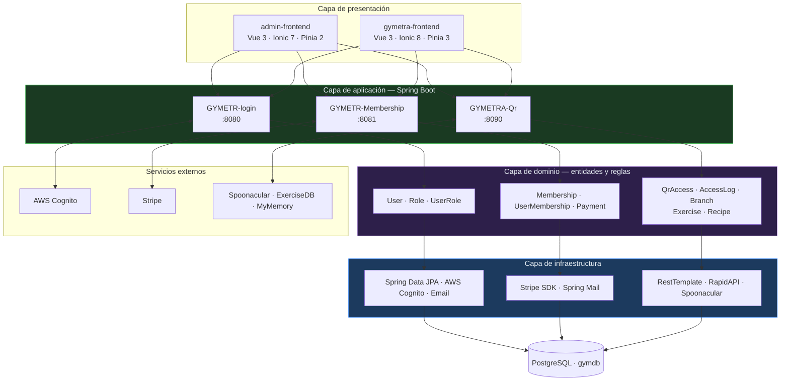

# 05 — Arquitectura

> **¿Cómo está organizado GYMETRA y por qué?** Las decisiones técnicas, sus alternativas
> descartadas y sus consecuencias.

## Por qué documentar decisiones, no solo código

El código dice **qué** hace el sistema. Un ADR dice **por qué** lo hace así y, sobre todo,
**qué alternativas se descartaron y por qué**. Sin esa información, la siguiente persona que
tenga que cambiar una decisión se enfrenta a un "¿por qué está hecho así?" sin respuesta, y
lo más probable es que lo cambie sin entender el costo.

---

## Documentos de esta sección

| Documento | Contenido |
|-----------|-----------|
| [`vision-general.md`](./vision-general.md) | Arquitectura del sistema en detalle, C4, comunicación entre servicios |
| [`arquitectura-hexagonal.md`](./arquitectura-hexagonal.md) | Cómo se aplica arquitectura hexagonal en GYMETRA |
| [`guia-de-patrones.md`](./guia-de-patrones.md) | Patrones GoF y de microservicios aplicados |
| [`decisiones/README.md`](./decisiones/README.md) | Índice de decisiones de arquitectura |
| [`decisiones/_plantilla-adr.md`](./decisiones/_plantilla-adr.md) | Plantilla para escribir un ADR |

---

## Decisiones registradas

| ADR | Título | Estado | Impacto |
|-----|--------|--------|---------|
| [ADR-001](./decisiones/registros/ADR-001-idioma-documentacion.md) | Idioma de la documentación | Accepted | Bajo |
| [ADR-002](./decisiones/registros/ADR-002-base-datos-compartida.md) | Base de datos compartida entre microservicios | Accepted | 🔴 **Alto** |
| [ADR-003](./decisiones/registros/ADR-003-autenticacion-cognito.md) | AWS Cognito como proveedor de identidad | Accepted | Medio |
| [ADR-004](./decisiones/registros/ADR-004-pagos-stripe.md) | Stripe como pasarela de pagos | Accepted | Medio |
| [ADR-005](./decisiones/registros/ADR-005-base-datos-postgresql.md) | PostgreSQL como almacén de datos | Accepted | Bajo |
| [ADR-006](./decisiones/registros/ADR-006-proxy-validacion-membresia.md) | Validación de membresía por proxy HTTP | Accepted | 🟠 Medio |

---

## Resumen de la arquitectura

---

## Decisiones técnicas más relevantes

| Área | Decisión | ADR |
|------|----------|-----|
| **Base de datos** | Un único PostgreSQL compartido por los tres servicios | [ADR-002](./decisiones/registros/ADR-002-base-datos-compartida.md) |
| **Identidad** | AWS Cognito como único emisor de tokens | [ADR-003](./decisiones/registros/ADR-003-autenticacion-cognito.md) |
| **Pagos** | Stripe, sin datos de tarjeta en el sistema | [ADR-004](./decisiones/registros/ADR-004-pagos-stripe.md) |
| **Almacén** | PostgreSQL 15 en Docker | [ADR-005](./decisiones/registros/ADR-005-base-datos-postgresql.md) |
| **Comunicación** | REST síncrono, sin cola de mensajes | [ADR-006](./decisiones/registros/ADR-006-proxy-validacion-membresia.md) |
| **Gateway** | No hay API Gateway; CORS directo | [ADR-002](./decisiones/registros/ADR-002-base-datos-compartida.md) |

---

## Estado de la arquitectura

| Aspecto | Evaluación |
|---------|-----------|
| **Desacoplamiento de despliegue** | ⚠️ Parcial — los servicios son independientes en código, pero comparten base de datos |
| **Autonomía de datos** | ❌ No cumplida — una base para tres servicios |
| **Tolerancia a fallos** | ⚠️ Parcial — QR falla cerrado ante caída de Membership, pero en silencio |
| **Escalabilidad** | ⚠️ Parcial — el código escala, pero la base compartida limita |
| **Seguridad** | ⚠️ Parcial — Cognito bien implementado, pero hay secretos filtrados y endpoints abiertos |
| **Observabilidad** | ❌ Ausente — sin métricas, trazas ni alertas |

---

## Preguntas que esta sección debe responder

- ¿Cómo se distribuye el sistema en servicios y por qué esos límites?
- ¿Qué decisiones se tomaron y qué alternativas se descartaron?
- ¿Qué pasa si un servicio se cae?
- ¿Dónde están los puntos de acoplamiento fuerte?
- ¿Qué habría que cambiar para hacer el sistema realmente independiente?
