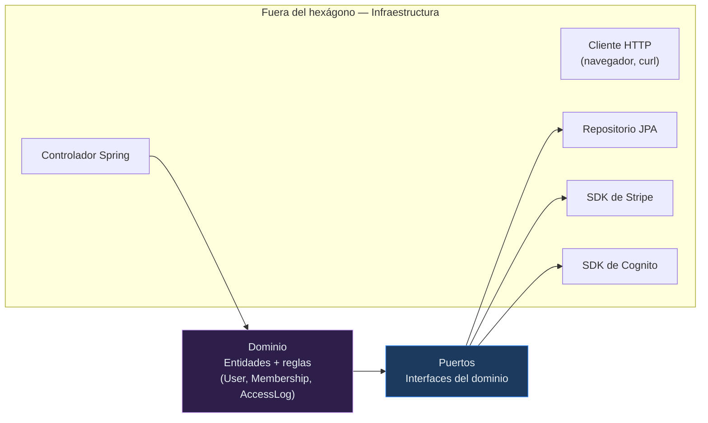
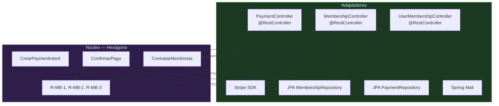

# Arquitectura hexagonal en GYMETRA

> Cómo se mapea el modelo de puertos y adaptadores a la estructura real del código.

## 1. Qué es la arquitectura hexagonal

La arquitectura hexagonal (Ports & Adapters) separa el **núcleo de negocio** de los detalles
de infraestructura. El núcleo no sabe que existe HTTP, ni que hay una base de datos, ni que
Stripe es una empresa. Todo eso entra por "puertos" y se implementa con "adaptadores".

El beneficio no es la purity teórica: es que **el negocio se puede probar sin levantar
nada**, y cambiar de tecnología no obliga a reescribir reglas.

---

## 2. El hexágono



**Las flechas apuntan hacia adentro.** La infraestructura depende del dominio, nunca al
revés. Si el dominio necesitara importar `org.springframework.web.bind.annotation`, la
dependencia estaría invertida.

---

## 3. Correspondencia con el código real

| Capa hexagonal | En GYMETRA | Responsabilidad |
|----------------|-----------|-----------------|
| **Núcleo (dominio)** | `entity/` | Entidades JPA y sus invariantes |
| **Núcleo (aplicación)** | `service/` | Casos de uso y reglas de negocio |
| **Puerto de entrada** | `controller/` | Interfaz HTTP del servicio |
| **Puerto de salida (persistencia)** | `repository/` | Interfaces Spring Data |
| **Puerto de salida (pagos)** | Uso directo del SDK de Stripe en `PaymentService` | ❌ No hay interfaz |
| **Puerto de salida (identidad)** | `CognitoUserSyncService` | ⚠️ Clase concreta, no interfaz |
| **Adaptador de entrada** | Spring MVC (`@RestController`) | Convierte HTTP ↔ objetos Java |
| **Adaptador de salida** | Hibernate + PostgreSQL | Persistencia real |
| **Driver** | `axios` / `fetch` en los frontends | Cliente HTTP |

---

## 4. Diagrama del hexágono de Membership



---

## 5. Lo que GYMETRA hace bien

1. **Separación por paquetes consistente** en los tres servicios: `controller`, `service`,
   `entity`, `repository`, `config`, `dto` y `exception`. No existe paquete `model/`. La única
   salvedad es dónde vive el manejador global: `exception/GlobalExceptionHandler` en Membership
   y en QR, `controller/GlobalExceptionHandler` en Login.
2. **Manejadores de excepción globales** que traducen excepciones a respuestas HTTP. Eso
   evita try-catch repetido en los controladores.
3. **Inyección por constructor** en lugar de por campo. Facilita las pruebas.

---

## 6. Lo que GYMETRA no hace bien

### 6.1 No hay puertos reales para las integraciones externas

`PaymentService` usa el SDK de Stripe directamente:

```java
// Menos testeable: no se puede sustituir Stripe por un doble en pruebas
PaymentIntent intent = PaymentIntent.create(params, requestOptions);
```

Lo ideal es definir una interfaz en el núcleo:

```java
// Puerto de salida
public interface PasarelaDePago {
    ResultadoCrearPago crearPaymentIntent(BigDecimal monto, String moneda,
                                          String descripcion, String customerId);
    EstadoPago consultarEstado(String paymentIntentId);
}
```

y que `StripePasarelaDePago` sea el adaptador. Con la interfaz, `PaymentService` se puede
probar con un doble en memoria, sin red y sin claves de API. Es el punto exacto donde la
falta de pruebas (R-04) y la falta de puertos se refuerzan entre sí.

### 6.2 El modelo de dominio depende de JPA

Las entidades están anotadas con `@Entity` y usan `@Column`, `@Table`, `@ManyToOne`. Eso
acopla el dominio a Hibernate. Dos efectos visibles:

1. **Los nombres de columna dependen de la estrategia implícita del framework.** En
   `Exercise`, el campo `gifUrl` no declara `@Column(name=...)`, así que persiste en la
   columna `gif_url` porque Spring Boot 3 aplica
   `CamelCaseToUnderscoresNamingStrategy`; lo mismo con `Recipe.imageUrl` → `image_url`.
   La convención snake_case **se cumple**, pero por convención del framework y no por
   declaración explícita de la entidad: el esquema real queda determinado por un
   comportamiento por defecto que el código no muestra. Es inocuo mientras todos los
   accesos usen JPA, pero obliga a conocer esa estrategia para leer la base o escribir
   SQL a mano (los nombres camelCase solo existen en la entidad y en el JSON).
2. **Tipos Java usados con límites de la base sin declarar.** `User.userId` es `Long`
   (PostgreSQL `bigint`), pero `UserMembership.userId` es `Integer` (`integer`). La entidad
   no declara `@ManyToOne`, así que JPA no valida el vínculo (la clave foránea existe solo
   si la creó el script SQL, con `ON DELETE CASCADE`) y nada impide que se trunque un
   identificador grande. Ver [`06-datos`](../06-datos/modelo-de-datos.md).

### 6.3 No hay separación entre aplicación y dominio

Los servicios (`service/`) hacen tres cosas a la vez: validaciones de negocio, orquestación
de llamadas a otros servicios y llamadas a repositorios. No hay un capa de casos de uso
intermedia. En `AccessLogBusinessService` conviven las reglas de turno, la validación de
membresía vía HTTP y la carga de todas las entidades en memoria.

### 6.4 Cargar tablas completas en memoria

Varios métodos hacen `.findAll()` y luego filtran en Java:

```java
// Antipatrón: trae toda la tabla para usar dos filas
List<UserMembership> membresias = repo.findAll();
for (UserMembership m : membresias) {
    if (m.getUser().getId().equals(userId)) { ... }
}
```

Funciona con cien socios. Con cien mil, revienta la memoria del contenedor. El equivalente
correcto es `repo.findByUserId(userId)`.

### 6.5 El invariante de estado de `Payment` no está implementado

Un pago ya confirmado no debería poder volver a `PENDING` ni modificarse. **Ese invariante no
existe en el código.** `Payment` usa el `@Setter` de Lombok, el campo se llama `paymentStatus`
y no hay ninguna comprobación de transición de estados: `setPaymentStatus(...)` acepta
cualquier valor desde cualquier punto. Es deuda pendiente, no una propiedad del diseño — y no
es el único sitio donde faltan invariantes en el dominio.

---

## 7. Cómo se vería con hexagonal real

| Paso | Cambio | Beneficio |
|------|--------|-----------|
| 1 | Interfaces para integraciones externas | Servicios testeables sin red |
| 2 |Repositorios con métodos de consulta, sin `findAll()` + filtro | Escalabilidad de datos |
| 3 | Capa de casos de uso separada de los servicios | Reglas de negocio aisladas |
| 4 | Mover anotaciones JPA a un modelo de persistencia separado | Dominio limpio |
| 5 | Pruebas unitarias del núcleo | Cobertura de R-24 sin levantar infraestructura |

> **Importante:** no es necesario rehacer el sistema. Los pasos 1 y 2 son los de mayor
> retorno y son cambios acotados.

---

## 8. Criterios de evaluación

| Criterio | Estado | Nota |
|----------|--------|------|
| El dominio no depende de la infraestructura | ❌ | Las entidades dependen de JPA |
| Las integraciones externas están detrás de interfaces | ❌ | Stripe y Cognito se usan directamente |
| Los casos de uso son testables sin red | ❌ | No hay puertos |
| Los repositorios exponen consultas, no `findAll` | ⚠️ | Parcial |
| Las excepciones se traducen en los adaptadores | ✅ | Hay manejadores globales |
| La inyección es por constructor | ✅ | Correcto |

---

## Documentos relacionados

- [`vision-general.md`](./vision-general.md) — arquitectura del sistema
- [`guia-de-patrones.md`](./guia-de-patrones.md) — patrones aplicados
- [`decisiones/registros/ADR-002-base-datos-compartida.md`](./decisiones/registros/ADR-002-base-datos-compartida.md) — por qué hay una sola base
- [`../09-microservicios/servicios/01-gymetr-login/README.md`](../09-microservicios/servicios/01-gymetr-login/README.md) — estructura de un servicio
