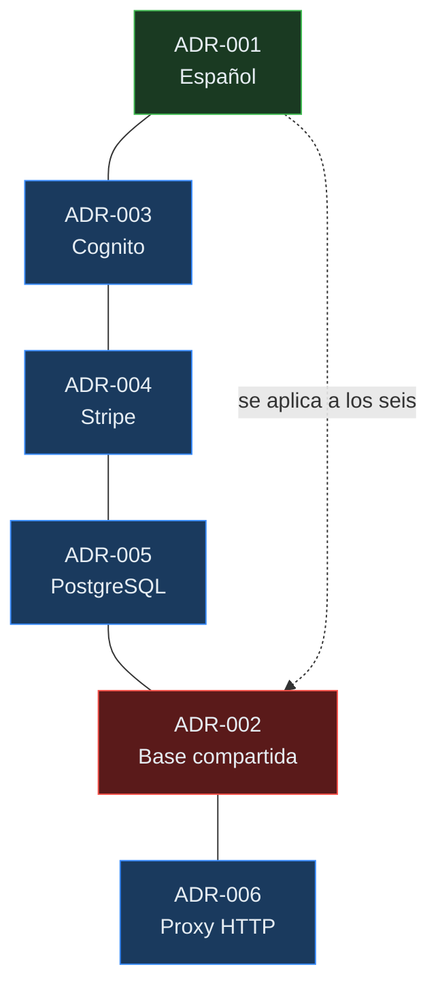

# Decisiones de arquitectura

> Registro de las decisiones técnicas que definen GYMETRA: qué se decidió, qué alternativas
> se descartaron y qué consecuencias tiene.

## ¿Qué es un ADR?

Un **Architecture Decision Record** es una nota corta que documenta una decisión técnica en
el momento en que se toma. No es documentación de lo que el código hace (eso es el código),
sino de **por qué se hizo así** y **qué se dejó de hacer**.

Los ADRs son inmutables por diseño. Si una decisión cambia, se escribe un ADR nuevo que la
reemplaza, y el anterior se marca como `Superseded by ADR-XXX`. La razón es que el valor
está en preservar el razonamiento: dentro de dos años, alguien preguntará por qué se
repitió un error aparente, y la respuesta está en el ADR que se escribió cuando todavía se
tenía todo el contexto.

---

## Formato

Cada ADR sigue el formato de Michael Nygard:

> **Regla de oro:** si un ADR no tiene la sección 3, no está terminado. La parte
> interesante de una decisión casi nunca es lo que se eligió, sino lo que vino después.

---

## Estados

| Estado | Significado |
|--------|-------------|
| `Proposed` | En discusión, no aplica todavía |
| `Accepted` | Vigente, es lo que el sistema hace |
| `Deprecated` | Ya no se aplica, pero el código aún existe |
| `Superseded by ADR-XXX` | Reemplazado por una decisión posterior |
| `Rejected` | Se consideró y se descartó |

---

## Decisiones registradas

| ADR | Título | Estado | Fecha | Decisor | Impacto |
|-----|--------|--------|-------|---------|---------|
| [ADR-001](./registros/ADR-001-idioma-documentacion.md) | Idioma de la documentación | Accepted | 2026-09 | Equipo GYMETRA | Bajo |
| [ADR-002](./registros/ADR-002-base-datos-compartida.md) | Base de datos compartida entre microservicios | Accepted | 2026-09 | Equipo GYMETRA | 🔴 Alto |
| [ADR-003](./registros/ADR-003-autenticacion-cognito.md) | AWS Cognito como proveedor de identidad | Accepted | 2026-09 | Equipo GYMETRA | Medio |
| [ADR-004](./registros/ADR-004-pagos-stripe.md) | Stripe como pasarela de pagos | Accepted | 2026-09 | Equipo GYMETRA | Medio |
| [ADR-005](./registros/ADR-005-base-datos-postgresql.md) | PostgreSQL como almacén de datos | Accepted | 2026-09 | Equipo GYMETRA | Bajo |
| [ADR-006](./registros/ADR-006-proxy-validacion-membresia.md) | Validación de membresía por proxy HTTP | Accepted | 2026-09 | Equipo GYMETRA | 🟠 Medio |

---

## Resumen de decisiones en una línea

| # | Decisión | En una línea |
|---|----------|--------------|
| 001 | Documentación en español | La documentación está en el idioma del equipo, no en inglés. |
| 002 | Base compartida | Una sola base para tres servicios: simple de montar, imposible de escalar de forma independiente. |
| 003 | Cognito | Delegar identidad a un proveedor gestionado reduce código y riesgo de seguridad. |
| 004 | Stripe | Nunca tocar datos de tarjeta reduce el alcance de cumplimiento PCI. |
| 005 | PostgreSQL | Una base relacional es suficiente y bien conocida para el volumen esperado. |
| 006 | Proxy HTTP | QR consulta a Membership en vivo, evitando datos desactualizados. |

---

## Contexto adicional de cada decisión

---

## Cómo escribir un ADR

1. Copia [`_plantilla-adr.md`](./_plantilla-adr.md) a `registros/`.
2. Nómbralo `ADR-NNN-titulo-corto.md`, con el siguiente número correlativo.
3. Escribe el **contexto** sin tomar partido. Explica qué problema había.
4. Escribe la **decisión** en presente de indicativo: "Usamos PostgreSQL", no "Deberíamos".
5. Escribe las **consecuencias**, incluyendo las malas.
6. Pide revisión antes de marcar `Accepted`.
7. Actualiza la tabla de este índice.

---

## Cuándo escribir un ADR

| Situación | ¿ADR? |
|-----------|--------|
| Elegir un framework, base de datos o proveedor externo | ✅ Sí |
| Cambiar un límite entre servicios | ✅ Sí |
| Reemplazar una decisión anterior | ✅ Sí, marcar el anterior como `Superseded` |
| Añadir una librería interna | ❌ No |
| Corregir un bug | ❌ No |
| Cambiar el color de un botón | ❌ No |

> **Criterio útil:** si dentro de seis meses alguien va a preguntar "¿por qué está hecho
> así?", escribe un ADR.

---

## Documentos relacionados

- [`../vision-general.md`](../vision-general.md) — arquitectura del sistema
- [`_plantilla-adr.md`](./_plantilla-adr.md) — plantilla para escribir ADRs
- [`../../06-datos/modelo-de-datos.md`](../../06-datos/modelo-de-datos.md) — estructura de la base
- [`../../15-control-proyecto/README.md`](../../15-control-proyecto/README.md) — decisiones de proyecto
