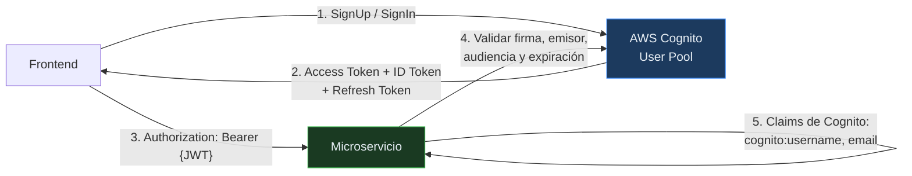

# ADR-003 — AWS Cognito como proveedor de identidad

| Campo | Valor |
|-------|-------|
| **ID** | ADR-003 |
| **Título** | AWS Cognito como proveedor de identidad |
| **Fecha** | 2026-09 |
| **Estado** | Accepted |
| **Decisor** | Equipo GYMETRA |
| **Reemplaza** | — |
| **Impacto** | Medio |

---

## 1. Contexto

GYMETRA necesita gestionar la identidad de socios, administradores y entrenadores:
registro, inicio de sesión, recuperación de contraseña y, sobre todo, **autorización** (no
todos los usuarios pueden ver métricas ni gestionar roles).

Implementar identidad desde cero en Spring Security es posible, pero implica responder a
preguntas que un proveedor ya resuelve: almacenamiento seguro de contraseñas, políticas de
contraseña, bloqueo por intentos fallidos, verificación de correo, recuperación de contraseña,
tokens, rotación de claves, auditoría de accesos y cumplimiento normativo.

**Restricciones del proyecto:**

- El equipo es pequeño y su objetivo es el dominio del gimnasio, no la seguridad.
- No hay personal dedicado a infraestructura ni a seguridad.
- El proyecto ya vive en el ecosistema de AWS (se despliega en EC2).

### Alternativas consideradas

| Alternativa | Ventajas | Desventajas | ¿Por qué se descartó? |
|-------------|----------|--------------|------------------------|
| **Spring Security local** | Control total, sin dependencias externas, sin coste | Hay que implementar MFA, recuperación, bloqueo, tokens, rotación | Demasiado código de seguridad para mantener sin equipo dedicado |
| **Keycloak autoalojado** | Open source, muy completo, control total | Un servicio más que operar, que respaldar y actualizar | Añade carga operativa a un equipo pequeño |
| **Firebase Auth** | Fácil de integrar | Dependencia de Google, coste por MAU, otro ecosistema | No encaja con el resto de AWS |
| **AWS Cognito (elegida)** | Gestionado, escalable, sin infraestructura que operar, se integra bien con AWS | Coste por MAU activo, curva de aprendizaje, configuración a veces poco intuitiva | Se eligió por reducir carga operativa |

**Fundamento:** delegar la identidad a un proveedor gestionado convierte un problema difícil
de seguridad en un problema de configuración. El coste por MAU de Cognito es
insignificante para el volumen de socios de un gimnasio.

---

## 2. Decisión

**AWS Cognito es el único proveedor de identidad de GYMETRA.** Cognito emite los tokens JWT y
cada microservicio los valida localmente, sin llamar a Cognito en cada petición.

### Cómo funciona en el sistema

**Puntos clave de la implementación:**

| Aspecto | Implementación |
|---------|----------------|
| **Validación del token** | Spring Security como Resource Server con `issuer-uri` de Cognito, más validación de audiencia contra el `client-id` |
| **Claim de identidad** | `cognito:username` contiene el ID interno del usuario en GYMETRA |
| **Autorización** | `cognito:groups` se traduce a authorities `ROLE_<grupo>` mediante `JwtAuthenticationConverter` |
| **Sincronización** | `POST /api/auth/users/sync` replica usuarios de Cognito a la BD local. Es el **único** camino de alta |
| **Contraseñas** | 🔴 No se almacenan en ninguna forma. Cognito las custodia y GYMETRA nunca las recibe. `password_hash` existe pero nadie la escribe |
| **Recuperación** | 🔴 No implementada. `PasswordResetToken` está declarado pero ningún servicio lo usa |

> **Detalle importante:** GYMETRA mantiene **doble fuente de verdad** para el usuario — el
> User Pool de Cognito y la tabla `user` de PostgreSQL. Cognito es quien autentica, pero la
> base local es la fuente de verdad para los datos de negocio (roles, estado, perfil). Es un
> diseño válido, pero obliga a que la sincronización entre ambas sea consistente. Hoy esa
> consistencia depende de que alguien recuerde ejecutar el `sync` a mano.
>
> 🔴 Y la consistencia no se alcanza: la tabla local se puebla **después** del registro, nunca
> durante. Entre el alta en Cognito y el `sync`, el socio no existe para el sistema. Ver R-21.

---

## 3. Consecuencias

### Positivas

- No hay que mantener infraestructura de autenticación: Cognito escala y se actualiza solo.
- La configuración del User Pool aplica políticas de contraseña, bloqueo por intentos y
  verificación de correo sin código propio.
- Los tokens son JWT **stateless**: cada microservicio los valida por firma, sin consultar
  la base de datos de sesiones en cada petición. Eso es lo que permite que QR no dependa
  de Login para autorizar.
- La traducción de `cognito:groups` a `ROLE_*` permite usar `@PreAuthorize` de Spring de
  forma estándar.
- Se elimina el riesgo de almacenar contraseñas: Cognito nunca expone las contraseñas y
  GYMETRA **no las almacena en ninguna forma**, ni en claro ni hasheadas.
- No hay que mantener un endpoint de alta: Cognito gestiona el registro y el backend solo
  importa lo que ya existe.

### Negativas

- ⚠️ **Dependencia crítica de un servicio externo.** Si Cognito no responde, nadie puede
  iniciar sesión. No hay alternativa local.
- ⚠️ **Costo variable** por MAU activo.
- ⚠️ **Doble fuente de verdad** para los datos de usuario, con el riesgo de desincronización
  descrito arriba.
- ⚠️ **Configuración del emisor repartida por servicio.** En `GYMETR-login` el `issuer-uri`
  está solo en `application.yml` — ni `application-prod.properties` ni
  `application.properties.bak` lo declaran —, mientras que Membership y QR lo tienen en su
  propio `application.properties` (`spring.security.oauth2.resourceserver.jwt.issuer-uri` y
  `app.security.cognito.issuer`). Los tres leen la misma variable de entorno
  `COGNITO_ISSUER_URI`, así que hoy no divergen, pero nada lo garantiza: si un servicio
  apunta a otro emisor, acepta tokens que otro rechaza.
- ⚠️ **El frontend llama a Cognito directamente.** Requiere exponer el dominio y el ID del
  User Pool Client en el bundle, y obliga a configurar con cuidado las opciones de
  autenticación del cliente (hoy `ALLOW_ADMIN_USER_PASSWORD_AUTH` y
  `ALLOW_USER_PASSWORD_AUTH` están habilitadas).
- ⚠️ **Dependencia del proveedor de AWS.** Cambiar de proveedor implicaría reescribir la
  validación de tokens en los tres servicios.
- 🔴 **Restos del diseño anterior sin limpiar.** `RegisterRequest`, `LoginRequest`,
  `LoginResponse` y `JwtResponse` siguen en el código y **ninguna otra clase los referencia**.
  Son la huella de una autenticación local que se sustituyó por Cognito. También queda
  `PasswordResetToken`, sin usar. Mantenerlos sugiere capacidades que no existen y puede
  llevar a otro desarrollador a "completar" un flujo que ya no aplica.
- 🔴 **La suspensión de socios no suspende nada.** `PATCH /api/auth/users/{userId}/status` escribe
  `"suspended"` en la tabla local, pero no llama a Cognito para deshabilitar la cuenta. Como la
  autenticación vive en Cognito, el socio suspendido sigue entrando. Ver R-23.

---

## 4. Alternativas para el futuro

**Revisar esta decisión si:**

- El volumen de usuarios crece de forma tal que el costo de Cognito se vuelve significativo.
- Se requiere MFA obligatorio y Cognito no lo soporta bien en el flujo actual.
- Se necesita identidad federada con redes sociales (Cognito lo soporta, pero la
  configuración actual no).
- GYMETRA se independiza de AWS.

**Alternativa intermedia si se necesita reducir dependencia:** mantener Cognito para
autenticación pero trasladar la autorización a GYMETRA, leyendo los roles de la BD local en
lugar de los grupos de Cognito. Eso elimina la dualidad de fuentes para roles, aunque no la
dualidad de identidad.

---

## 5. Estado de implementación

| Aspecto | Estado |
|---------|--------|
| ¿Está implementado? | Sí |
| ¿Desde cuándo? | Desde el inicio del proyecto |
| ¿Dónde? | `SecurityConfig` de `GYMETR-login`, `application.yml`, `AuthController`, `CognitoUserSyncService` |
| ¿Documentado? | Este ADR, reglas de seguridad, runbook de login |

---

## Documentos relacionados

- [ADR-002 — Base de datos compartida](./ADR-002-base-datos-compartida.md) — la base local que duplica parte de la identidad
- [`../../../00-gobernanza/reglas-de-seguridad.md`](../../../00-gobernanza/reglas-de-seguridad.md) — reglas de seguridad
- [vision-general.md](../../vision-general.md) — flujo de registro
- [`../../../09-microservicios/servicios/01-gymetr-login/README.md`](../../../09-microservicios/servicios/01-gymetr-login/README.md) — detalle del servicio
