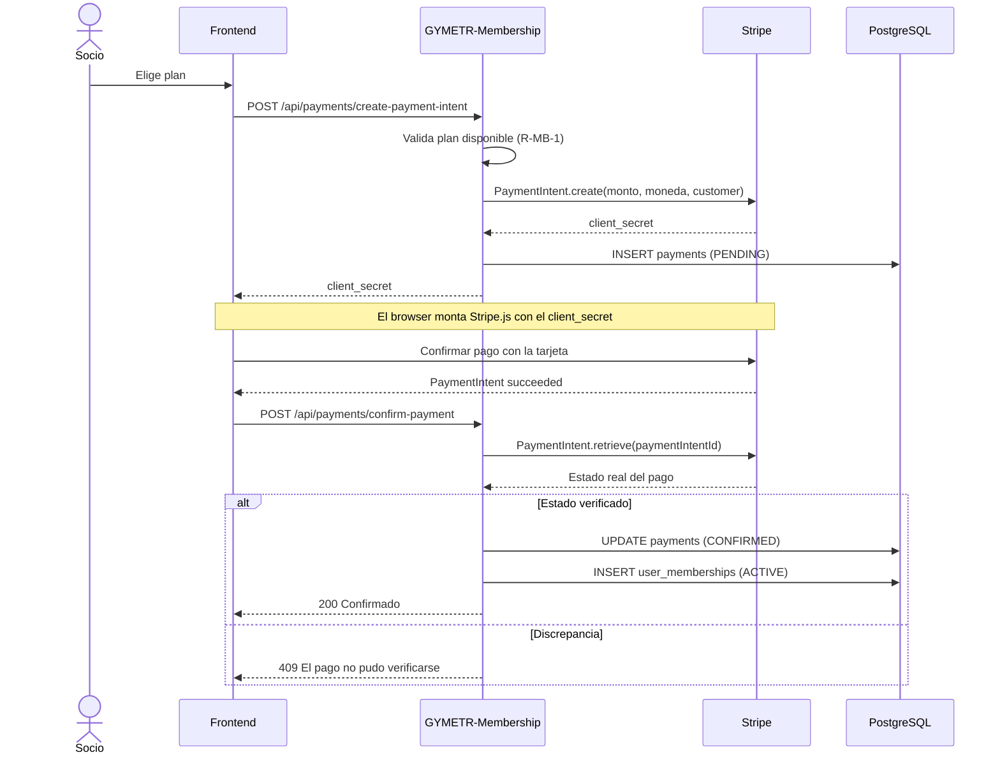

# ADR-004 — Stripe como pasarela de pagos

| Campo | Valor |
|-------|-------|
| **ID** | ADR-004 |
| **Título** | Stripe como pasarela de pagos |
| **Fecha** | 2026-09 |
| **Estado** | Accepted |
| **Decisor** | Equipo GYMETRA |
| **Reemplaza** | — |
| **Impacto** | Medio |

---

## 1. Contexto

GYMETRA cobra suscripciones mensuales a los socios. Eso implica procesar pagos con tarjeta
de crédito o débito, lo que abre un conjunto importante de obligaciones: cumplimiento del
estándar PCI DSS, protección de datos, gestión de disputas, devoluciones y fraude.

Implementar pagos directamente es una de las áreas de mayor riesgo de cualquier sistema:
un error puede significar cobro doble, pérdida de dinero o una brecha de datos de tarjetas.

**Restricciones del proyecto:**

- El proyecto es un servicio interno para un gimnasio, no un marketplace.
- El equipo no puede pagar certificaciones de cumplimiento PCI.
- El cobro debe funcionar tanto en la web como, potencialmente, en el futuro desde la app.

### Alternativas consideradas

| Alternativa | Ventajas | Desventajas | ¿Por qué se descartó? |
|-------------|----------|--------------|------------------------|
| **Integrar la pasarela directamente** | Control total, sin comisión | PCI DSS completo, desarrollo criptográfico, alto riesgo | Riesgo desproporcionado para el caso de uso |
| **PayPal** | Conocido por los usuarios | API más compleja, peor soporte para suscripciones recurrentes en algunos países | Menos adecuado para cobros recurrentes |
| **Mercado Pago** | Popular en Latinoamérica, buena documentación | Cobertura según país, condiciones comerciales distintas | Alternativa válida; se decidió elegir Stripe por integración más limpia con Java |
| **Stripe (elegida)** | API madura, SDK oficial de Java, suscripciones nativas, precios predecibles | Comisión por transacción, dependencia externa | Menor riesgo global por delegar el manejo de la tarjeta |

**Fundamento:** Stripe tiene la mejor integración para Java, soporta pagos recurrentes de
forma nativa y su SDK oficial cubre los casos de uso. Delegar el manejo de la tarjeta a un
proveedor con experiencia reduce drásticamente el riesgo.

---

## 2. Decisión

**Stripe procesa todos los pagos. GYMETRA nunca almacena datos de tarjeta.**

La integración usa el modelo de **PaymentIntents** de Stripe, no el flujo antiguo de
`Charge`:

> ✅ **Punto fuerte de esta implementación:** `confirm-payment` **vuelve a consultar a
> Stripe** con `PaymentIntent.retrieve` en lugar de confiar en lo que el navegador le
> dice. El estado del pago se valida del lado del servidor. Es la mitigación correcta frente
> a un cliente malicioso que envíe un `paymentIntentId` inventado o de un pago cancelado.

---

## 3. Consecuencias

### Positivas

- GYMETRA nunca ve ni almacena el número de tarjeta, lo que reduce drásticamente el alcance
  de cumplimiento PCI.
- El SDK oficial de Java de Stripe cubre la generación de tokens, la gestión de clientes y
  la consulta de estados, sin código criptográfico propio.
- Los `PaymentIntents` soportan reintentos, cobros parciales y 3D Secure de forma nativa.
- `client_secret` es seguro de exponer al navegador: solo permite confirmar ese pago
  concreto, no crear otros.
- La entidad `Payment` guarda solo el identificador del pago de Stripe y los importes, no
  datos sensibles.

### Negativas

- ⚠️ **Comisión por transacción.** Cada cobro tiene un costo que se descuenta del ingreso.
- ⚠️ **Dependencia externa crítica.** Si Stripe no responde, no se pueden cobrar suscripciones.
  Los socios con membresías ya activas siguen teniendo acceso, pero no se pueden renewing.
- ⚠️ **Los datos de la tarjeta nunca pasan por el sistema**, lo cual es correcto, pero
  significa que para resolver una disputa hay que intervenir en el panel de Stripe.
- ⚠️ **Pruebas en modo test.** El SDK tiene un modo de prueba con tarjetas ficticias. Es
  importante que nunca se confundan ambos modos: una configuración incorrecta puede hacer
  que el sistema acepte una tarjeta de prueba como si fuera real, o que rechace tarjetas
  reales.
- ⚠️ **Sin webhooks.** El sistema consulta el estado directamente en lugar de recibir
  webhooks. Eso es aceptable para pagos síncronos, pero significa que si un pago se completa
  fuera del flujo normal (por ejemplo, un cobro autorizado que se liquida días después), el
  sistema puede no enterarse a tiempo.

### Neutras

- Los campos de `Payment` incluyen algunos duplicados (moneda en `payment` y en la
  membresía), lo que es inofensivo pero denota que la tabla se diseñó sin una normalización
  estricta. Ver [`../../../06-datos/diccionario-de-datos.md`](../../../06-datos/diccionario-de-datos.md).

---

## 4. Alternativas para el futuro

**Revisar esta decisión si:**

- El volumen de transacciones hace que las comisiones de Stripe sean significativos.
- Se necesitan métodos de pago locales que Stripe no ofrece en el país de operación.
- Se requiere mayor control sobre la experiencia de cobro.

**Evolución posible: integrar webhooks de Stripe.** En lugar de que el frontend notifique el
pago, Stripe enviaría un evento a un endpoint del servicio Membership. Eso permitiría
confirmar pagos que se completan de forma asíncrona y tener una fuente de verdad
autoritativa. Requeriría un endpoint público con verificación de firma.

---

## 5. Estado de implementación

| Aspecto | Estado |
|---------|--------|
| ¿Está implementado? | Sí |
| ¿Desde cuándo? | Desde el inicio del módulo de membresías |
| ¿Dónde? | `PaymentService`, `PaymentController`, `Payment` (modelo), `payment.controllerStripe` |
| Dependencia | `com.stripe:stripe-java:22.19.0` |
| ¿Documentado? | Este ADR, runbook de Membership, reglas de seguridad |

---

## Documentos relacionados

- [`../../../00-gobernanza/reglas-de-seguridad.md`](../../../00-gobernanza/reglas-de-seguridad.md) — manejo de secretos de Stripe
- [vision-general.md](../../vision-general.md) — flujo de pago
- [`../../../09-microservicios/servicios/02-gymetr-membership/README.md`](../../../09-microservicios/servicios/02-gymetr-membership/README.md) — detalle del servicio
- [`../../../02-dominio/entidades-y-reglas.md`](../../../02-dominio/entidades-y-reglas.md) — reglas R-MB-2 y R-MB-3
