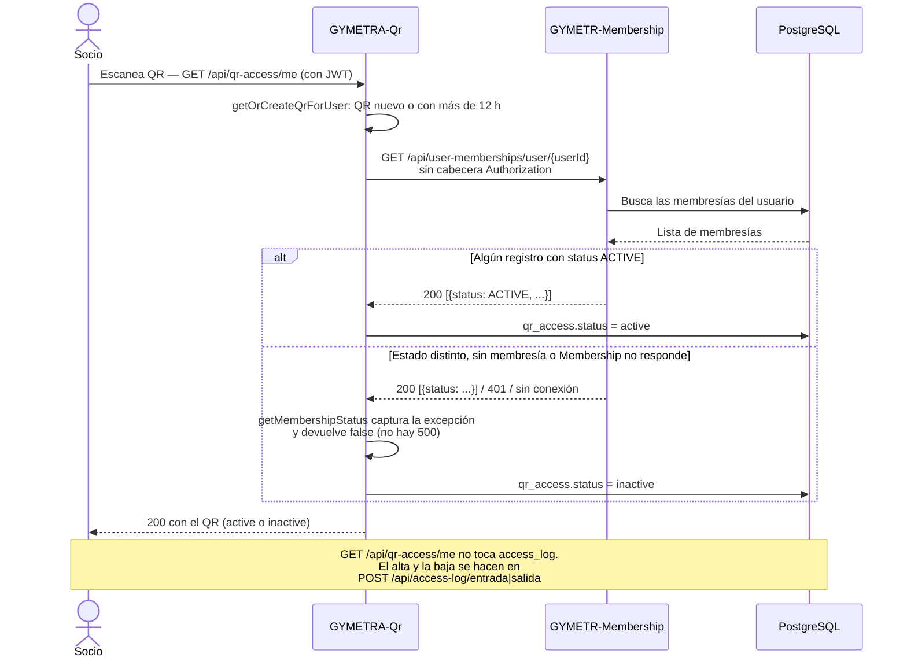

# ADR-006 — Validación de membresía por proxy HTTP

| Campo | Valor |
|-------|-------|
| **ID** | ADR-006 |
| **Título** | Validación de membresía por proxy HTTP |
| **Fecha** | 2026-09 |
| **Estado** | Accepted |
| **Decisor** | Equipo GYMETRA |
| **Revisado por** | Arquitectura GYMETRA |
| **Reemplaza** | — |
| **Impacto** | 🟠 Medio |

---

## 1. Contexto

Cuando un socio escanea su QR en la recepción del gimnasio, el servicio `GYMETRA-Qr` debe
decidir si permite el acceso. Esa decisión depende de información que pertenece a otro
servicio: `GYMETR-Membership` es el dueño de las suscripciones, sus estados (`ACTIVE`,
`SUSPENDED`, `CANCELED`, `EXPIRED`, `PENDING`) y los días restantes.

**El problema:** `GYMETRA-Qr` necesita una respuesta de Membership en el momento del escaneo,
y esa respuesta no puede estar desactualizada. Si el socio tiene la suscripción suspendida
por impago y el gimnasio le deniega el acceso, el fallo es directo y visible.

**Restricciones:**

- El proyecto no tiene infraestructura de bus de mensajes (Kafka, RabbitMQ, SQS).
- El flujo del escaneo es síncrono desde el punto de vista del usuario: espera la respuesta.
- Un sistema con horarios de apertura reales no puede depender de datos "razonablemente
  frescos".

### Alternativas consideradas

| Alternativa | Ventajas | Desventajas | ¿Por qué se descartó? |
|-------------|----------|--------------|------------------------|
| **Replicar el estado de la membresía en QR** | QR responde al instante, sin dependencia | Los datos se desactualizan; el fallo de sincronización abre la puerta a socios suspendidos | Riesgo de seguridad inaceptable: denegar acceso a un socio que pagó es un problema de negocio |
| **Leer `user_memberships` directamente de la base** | Sin latencia de red, sin nuevos endpoints | Acoplamiento fuerte con la base de Membership (ver [ADR-002](./ADR-002-base-datos-compartida.md)) | Se eligió la opción de red para no acoplar los esquemas, aunque se pays el precio en latencia |
| **Proxy HTTP en vivo (elegida)** | Datos siempre frescos, sin duplicar estado, respeta la propiedad de Membership | Acopla el tiempo de respuesta, añade un punto de fallo | Se acepta el acoplamiento: la corrección del dato importa más que la latencia |

**Fundamento:** se priorizó la **corrección sobre la velocidad**. Un socio suspendido que
igual entra al gimnasio es un problema de negocio y de reputación; 200 ms de latencia en un
escaneo de QR no lo es.

---

## 2. Decisión

**`GYMETRA-Qr` consulta a `GYMETR-Membership` por HTTP en el momento de cada validación de
acceso, a través de un controlador proxy dentro del propio servicio QR.**

El flujo de validación de permisos es:

**La ruta de permisos existe, pero no es la que usa el QR.**
`GET /api/user-memberships/user/{userId}/permission/{permission}` está declarada en
`UserMembershipController` y figura en el `permitAll()` de Membership, de modo que responde
sin token. Dos precisiones sobre lo que hace:

- `UserMembershipService.userHasPermission()` solo reconoce `training` y `nutrition`. Cualquier
  otro valor — `QR_READ` incluido — cae en el `return false` final. El método devuelve un
  booleano: **no hay ninguna respuesta `403` en ese camino**, solo `200 false`.
- El flujo de escaneo no la invoca. Quien consulta membresía es `QrBusinessService`, contra
  `GET /user-memberships/user/{userId}` (sin token → `401`, ver R-28). La ruta de permisos es
  la contingencia documentada de R-28 y la usan los endpoints de ejercicios y nutrición.

**Dos endpoints proxy** exponen la información de Membership a través de QR. En la práctica el
motivo original ya no se cumple: los frontends llaman a Membership **directamente**
(`useQrAccess.ts`, `useUserMembership.ts`), y estos dos endpoints no tienen invocadores en el
producto — solo las páginas de prueba empaquetadas y un `curl` manual:

| Endpoint en QR | Endpoint real en Membership |
|----------------|---------------------------|
| `GET /api/memberships-proxy/{userId}` | `GET /api/user-memberships/user/{userId}` |
| `GET /api/memberships-proxy/{userId}/check-permission/{permission}` | `GET /api/user-memberships/user/{userId}/permission/{permission}` |

---

## 3. Consecuencias

### Positivas

- El estado de la membresía es siempre el real. No hay ventana de inconsistencia.
- Membership conserva la propiedad de sus datos. Solo QR no decide quién puede entrar.
- Añadir una nueva regla de validación (por ejemplo, un horario restringido) se hace en
  un solo lugar: Membership.
- Los endpoints de Membership no quedan expuestos a la red pública: el navegador del socio
  nunca habla directamente con `:8081` para validar permisos.

### Negativas

- ⚠️ **Acoplamiento en tiempo de ejecución.** Si Membership está caído, **el acceso al
  gimnasio se cae por completo**. No hay degradación posible: la validación de permisos
  está en el camino crítico de cada escaneo.
- ⚠️ **Latencia sumada.** El escaneo suma la latencia de QR + Membership. En el peor caso
  (dos round-trips más una consulta a base de datos) el usuario puede esperar cientos de
  milisegundos sin feedback visible.
- ⚠️ **Fallo silencioso.** Cuando Membership no responde, el `RestTemplate` lanza excepción,
  pero `QrBusinessService.getMembershipStatus()` la captura y devuelve `false`: el QR queda o
  se crea como `inactive` y `POST /api/access-log/entrada` rechaza con `400` *"User does not
  have an active membership"*. **No hay `500`** y no hay ningún indicio en la respuesta de que
  el problema fuera de red en lugar de una membresía ausente: el socio ve un rechazo de
  negocio. Ver [`../../../09-microservicios/servicios/03-gymetra-qr/runbook.md`](../../../09-microservicios/servicios/03-gymetra-qr/runbook.md).
- ⚠️ **Dos rutas de configuración.** Si Membership cambia un endpoint, hay que actualizar
  el controlador proxy de QR y el cliente que lo consume. Nada obliga a que coincidan.
- ⚠️ **La ruta de permisos de Membership es `permitAll()`.**
  `GET /user-memberships/user/{userId}/permission/{permission}` no exige JWT, así que
  cualquiera que conozca la URL puede consultar los permisos de cualquier usuario por su ID
  (R-08). No hay que confundirla con `GET /user-memberships/user/{userId}`, que **sí** exige
  JWT y es la que hace fallar al QR (R-28).

---

## 4. Alternativas para el futuro

**Revisar esta decisión si:**

- El tiempo de espera de los socios en la puerta se vuelve un problema operativo.
- Se decide migrar a una arquitectura orientada a eventos (ver R-28 en riesgos).
- Membership se despliega con indisponibilidad planificada regularly.

**Evolución posible: caché local con invalidación por evento.**

1. QR guarda el estado de la membresía en caché (por ejemplo, Caffeine, TTL de 5 min).
2. Membership publica un evento `MembershipStatusChanged` al cambiar un estado.
3. QR invalida la entrada de caché correspondiente.
4. La validación lee de caché; si hay error de red, usa el valor cacheado y registra el
   evento para auditar.

**Trade-off:** introduce una ventana de inconsistencia de hasta 5 minutos, exactamente la
que esta decisión eliminó. Solo tiene sentido si se acepta que un socio con la
suscripción suspendida pueda entrar una última vez. La decisión correcta depende de si
GYMETRA prefiere optimización de throughput o control de acceso estricto.

---

## 5. Estado de implementación

| Aspecto | Estado |
|---------|--------|
| ¿Está implementado? | Sí |
| ¿Desde cuándo? | Desde la implementación de la validación de QR |
| ¿Dónde? | `MembershipProxyController` en QR, `UserMembershipController` en Membership |
| ¿Documentado? | Este ADR, runbook del servicio QR |

---

## Documentos relacionados

- [ADR-002 — Base de datos compartida](./ADR-002-base-datos-compartida.md) — la razón por la que esta opción se volvió necesaria
- [vision-general.md](../../vision-general.md) — flujo de validación de acceso
- [`../../../09-microservicios/servicios/03-gymetra-qr/runbook.md`](../../../09-microservicios/servicios/03-gymetra-qr/runbook.md) — qué hacer si Membership está caído
- [`../../../15-control-proyecto/riesgos.md`](../../../15-control-proyecto/riesgos.md) — riesgo de punto único de fallo
