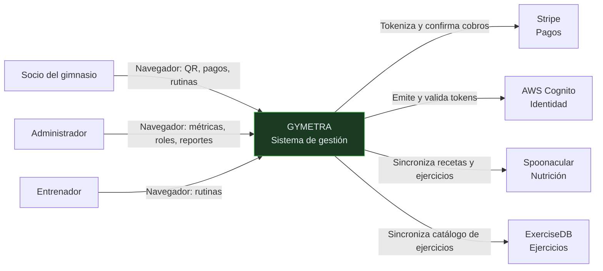
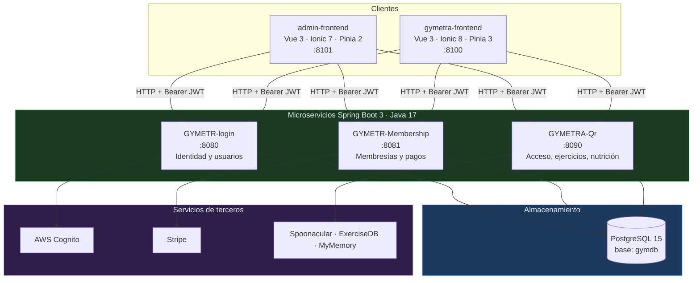
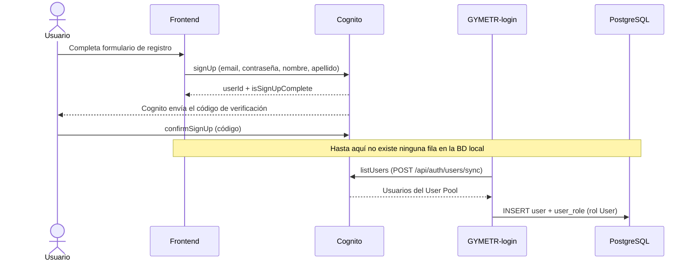
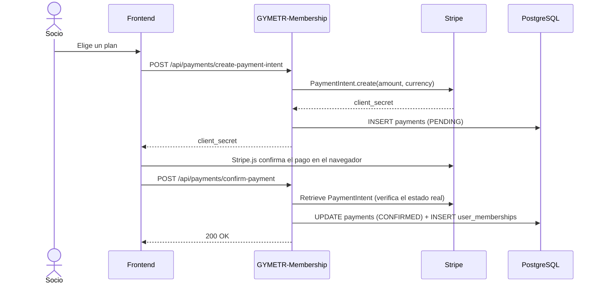
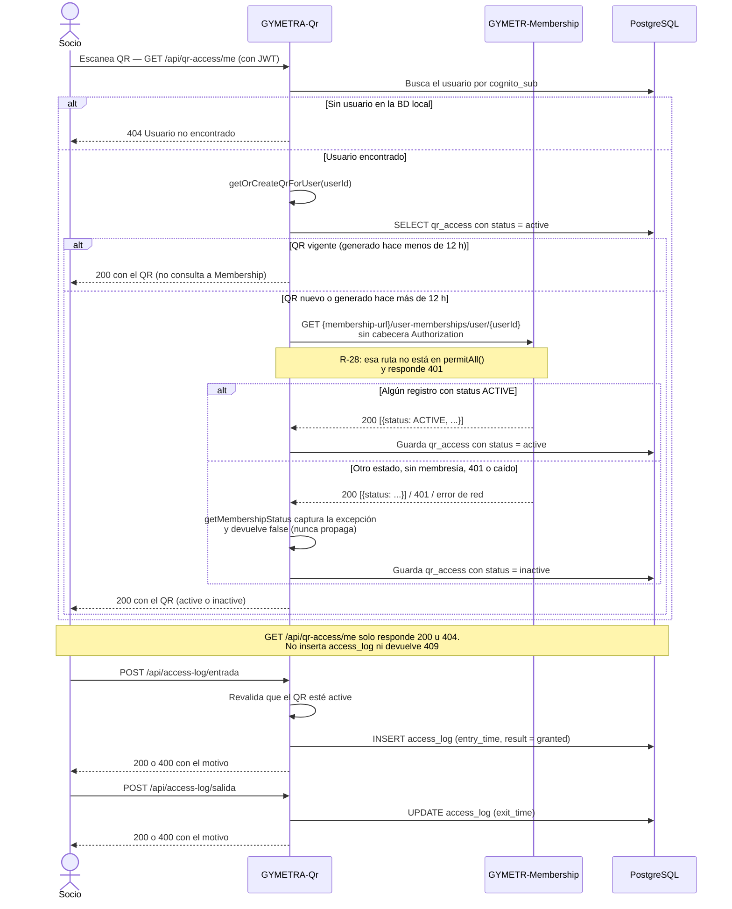
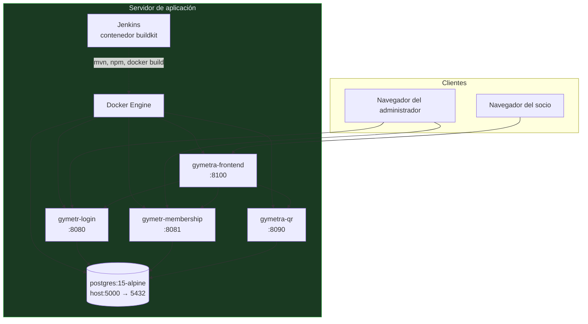

# Visión general de la arquitectura

> Descripción técnica de cómo está construido GYMETRA: sus servicios, capas, dependencias
> y modos de comunicación.

## 1. Contexto

GYMETRA es un sistema de gestión de gimnasios. Su problema central no es el software: es
que un gimnasio necesita saber **quién entró, quién no pagó y qué Ejercicios se le
prescribieron**, y hoy eso se resuelve con cuadernos y mensajes de WhatsApp.

El sistema se construyó como una aplicación web con tres microservicios backend y dos
frontends, deployados con Docker y un pipeline de Jenkins.

---

## 2. Vista de contexto (C1)



**Ubicación del sistema:** GYMETRA es un **sistema interno de la organización**, no un
producto en el mercado. Sus "usuarios" son socios, empleados y entrenadores del gimnasio.
Esto elimina toda la complejidad de multi-tenancy, escalado global y cumplimiento
regulatorio internacional que tendría un SaaS.

---

## 3. Vista de contenedores (C2)



---

## 4. Vista de componentes (C3)

### 4.1 GYMETR-login — `:8080`

**Responsabilidad:** identidad de personas, credenciales, roles y sincronización con Cognito.

| Capa | Componentes |
|------|-------------|
| **Presentación** | `AuthController`, `MeController`, `RoleController` |
| **Aplicación** | `UserService`, `RoleService`, `CognitoUserSyncService`, `EmailService` |
| **Dominio** | `User`, `Role`, `UserRole`, `PasswordResetToken` |
| **Infraestructura** | Spring Data JPA, `SecurityConfig`, Spring Security OAuth2 Resource Server, AWS Cognito, Spring Mail |

**Flujo de registro:**



> 🔴 **No hay endpoint de alta de socios.** El registro ocurre íntegramente contra Cognito
> desde el navegador; la fila en `user` nace después, cuando alguien ejecuta
> `POST /api/auth/users/sync`, que escanea el User Pool e importa a quien falte. Entre el
> registro y el `sync` el socio **no existe en la base local**. El rol que asigna la
> sincronización es `User`, mientras que `DataInitializer` siembra `Admin` y `Client`.
> Ver R-21.

> ⚠️ **El frontend llama a Cognito directamente desde el navegador.** Eso significa que
> `aws_cognito_domain` y `aws_cognito_client_id` están expuestos en el bundle de Vite.
> No es un secreto en el sentido estricto (son identificadores públicos por diseño en
> Cognito), pero obliga a proteger la configuración del User Pool Client, que hoy está en
> `ALLOW_ADMIN_USER_PASSWORD_AUTH` y `ALLOW_USER_PASSWORD_AUTH`.

### 4.2 GYMETR-Membership — `:8081`

**Responsabilidad:** planes, suscripciones de socios, pagos y configuración de la membresía.

| Capa | Componentes |
|------|-------------|
| **Presentación** | `MembershipController`, `UserMembershipController`, `PaymentController`, `DiagnosticController`, `TableInspectorController` |
| **Aplicación** | `MembershipService`, `UserMembershipService`, `PaymentService` |
| **Dominio** | `Membership`, `UserMembership`, `UserMembershipStatus`, `Payment` |
| **Infraestructura** | Spring Data JPA, Stripe SDK 22.19.0, Spring Mail, springdoc 2.7.0 |

**Flujo de pago:**



> ⚠️ **Punto a vigilar en `confirm-payment`:** el endpoint recibe el `paymentIntentId` que le
> envía el navegador. La mitigación correcta —y que sí está implementada— es llamar a
> `PaymentIntent.retrieve` a Stripe y validar el estado del lado del servidor, en lugar de
> confiar en lo que dice el cliente. Hay que verificar que esa verificación ocurre **antes**
> de marcar el pago como `CONFIRMED`.

### 4.3 GYMETRA-Qr — `:8090`

**Responsabilidad:** códigos QR de acceso, registro de entradas y salidas, sedes, catálogo
de ejercicios y planes de nutrición.

| Capa | Componentes |
|------|-------------|
| **Presentación** | `QrAccessController`, `AccessLogController`, `BranchController`, `ExerciseController`, `NutritionController`, `MembershipProxyController` |
| **Aplicación** | `AccessLogBusinessService`, `ExerciseSyncService`, `NutritionSyncService` |
| **Dominio** | `QrAccess`, `AccessLog`, `Branch`, `UserMin`, `Exercise`, `Recipe` |
| **Infraestructura** | Spring Data JPA, `RestTemplate`, springdoc 2.5.0 |

**Flujo de validación de acceso:**



> ⚠️ **Acoplamiento crítico (ADR-006), pero silencioso:** QR depende de Membership **por
> HTTP**, y sin embargo un fallo de Membership no produce un `500`.
> `QrBusinessService.getMembershipStatus()` envuelve la llamada en un `try/catch` que se traga
> cualquier excepción y devuelve `false`, así que el QR sale o queda `inactive` y el socio no
> puede entrar, sin que la respuesta de `/api/qr-access/me` indique nada raro. El efecto
> práctico es peor que un error visible: la validación de acceso se apaga sola. Y hay un caso
> peor aún — la ruta consultada, `GET /user-memberships/user/{userId}`, **no** está en el
> `permitAll()` de Membership, y el `RestTemplate` no envía token, así que responde `401`: el
> QR queda `inactive` aunque la membresía esté activa (R-28). El registro de la entrada y de
> la salida no ocurre aquí, sino en `POST /api/access-log/entrada|salida`.

---

## 5. Comunicación entre servicios

| Origen | Destino | Protocolo | Sincrónico | Uso |
|--------|---------|-----------|------------|-----|
| admin-frontend | GYMETR-login | HTTP + JWT | Sí | Gestión de usuarios y roles |
| admin-frontend | GYMETR-Membership | HTTP + JWT | Sí | Métricas, pagos, reportes |
| gymetra-frontend | GYMETR-login | HTTP + JWT | Sí | Login y perfil |
| gymetra-frontend | GYMETR-Membership | HTTP + JWT | Sí | Contratar planes, pagos |
| gymetra-frontend | GYMETRA-Qr | HTTP + JWT | Sí | QR, ejercicios, nutrición |
| **GYMETRA-Qr** | **GYMETR-Membership** | **HTTP** | **Sí** | **Consultar estado de la membresía y permisos** |
| GYMETR-login | AWS Cognito | SDK | Sí | Crear usuarios, sincronizar |
| GYMETR-Membership | Stripe | SDK | Sí | PaymentIntents |
| GYMETRA-Qr | Spoonacular | REST | Sí | Recetas y planes de nutrición |
| GYMETRA-Qr | ExerciseDB | REST | Sí | Catálogo de ejercicios |
| GYMETRA-Qr | MyMemory | REST | Sí | Traducción ES/EN |

> **Toda la comunicación es síncrona y punto a punto.** No hay cola de mensajes, ni bus de
> eventos, ni service discovery. Es la decisión más impactoante del sistema: acopla los
> tiempos de respuesta y hace que cada fallo de cascada sea inmediato. Ver
> [ADR-006](./decisiones/registros/ADR-006-proxy-validacion-membresia.md).

---

## 6. Vista de despliegue (C4)



> 🔴 **Tres inconsistencias de despliegue:**
> 1. `docker-compose.yml` expone PostgreSQL en `5000:5432` pero las aplicaciones
>    conectan a `localhost:5432`. Solo funciona si el puerto se cambia o si PostgreSQL
>    corre en el host fuera de Docker.
> 2. El Compose solo construye `gymetr-login` y `gymetra-frontend`. **Membership y QR no
>    tienen servicio en el Compose**, aunque las aplicaciones dependen de ambos.
> 3. `admin-frontend` tampoco está en el Compose, pese a ser un cliente crítico.

---

## 7. Estilos de comunicación entre clases

El código no usa brokers de eventos. La comunicación es **por llamadas HTTP entre
procesos** y, dentro de cada proceso, por inyección de dependencias de Spring.

| Relación | Mecanismo | Nota |
|----------|-----------|------|
| Frontend → Backend | `fetch` / `axios` con `Authorization: Bearer` | CORS habilitado en los tres |
| Backend → Cognito | `software.amazon.awssdk:cognitoidentityprovider` | Solo login |
| Backend → Stripe | `com.stripe:stripe-java:22.19.0` | Solo Membership |
| Backend → API de terceros | `RestTemplate` | Solo QR |
| Servicio → Servicio | `RestTemplate` | Solo QR → Membership |
| Clase → Clase | Spring `@Autowired` por constructor | En los tres servicios |

---

## 8. Estructura de paquetes

Los tres servicios usan la **misma convención de capas**, lo que es una buena decisión
porque hace que un desarrollador de un servicio entienda los otros dos.

```
com.<servicio>.GYMETRA
├── controller/     @RestController — endpoints HTTP
├── service/        lógica de negocio y orquestación
├── entity/         entidades JPA
├── repository/     Spring Data JPA
├── config/         configuración (seguridad, CORS, datos semilla)
├── dto/            objetos de entrada y salida
├── exception/      manejadores de excepción globales
└── GymetraApplication.java
```

No existe ningún paquete `model/`. Además, en Login el manejador de excepciones no está en
`exception/` sino en `controller/GlobalExceptionHandler.java`.

Excepciones: el servicio QR usa `com.GYMETRA.GYMETRA` como raíz y deja `qr` como subpaquete
(`com.GYMETRA.GYMETRA.qr.entity`, `com.GYMETRA.GYMETRA.qr.repository`, …), lo que rompe la
convención. Y el login usa `com.login.GYMETRA`, con minúscula en `login`.

---

## 9. Decisiones estructurales

| Decisión | Elección | Consecuencia |
|----------|----------|--------------|
| **Estilo de API** | REST sobre HTTP | Simple de consumir, sin contratos tipados salvo OpenAPI |
| **Estilo de datos** | Compartir base de datos | Acoplamiento fuerte de esquema; consultar [ADR-002](./decisiones/registros/ADR-002-base-datos-compartida.md) |
| **Autenticación** | JWT stateless validado por firma de Cognito | Cada servicio valida el token por su cuenta, sin llamar a Cognito en cada request |
| **Autorización** | Roles de Cognito traducidos a `ROLE_*` en Spring Security | Un admin puede tener permisos que no están en la BD local |
| **Integración de pagos** | Tokenización con Stripe | GYMETRA nunca ve el número de tarjeta |
| **Integración de ejercicios** | Sincronización periódica desde API pública | Requiere red; si falla, la BD queda vacía |
| **Integración de nutrición** | Spoonacular + traducción automática | En riesgo de apagón del servicio de traducción y agotamiento de cuota (R-27) |

---

## 10. Atributos de calidad y cómo los soporta la arquitectura

| Atributo | Soporte arquitectónico | Realidad |
|----------|------------------------|----------|
| Escalabilidad | Servicios independientes | Limitada por la base compartida |
| Disponibilidad | Sin estado en los backends | Depende de la base única y de los terceros |
| Seguridad | Cognito + JWT + Stripe | Secretos filtrados y endpoints abiertos |
| Trazabilidad | Sin instrumentación | No existe |
| Mantenibilidad | Capas y convención uniforme | Acoplamiento de datos y servicios de depuración olvidados |

---

## 11. Conclusión

La arquitectura de GYMETRA es **sencilla y razonable para su tamaño**: microservicios
Spring Boot, JWT stateless, Stripe para pagos, APIs públicas para catálogo. Las decisiones
no son extravagantes.

Su debilidad no está en las decisiones, sino en dos puntos concretos:

1. **La base de datos compartida** deshace buena parte del beneficio de los microservicios.
2. **La ausencia de pruebas, observabilidad y disciplina de secretos** convierte cualquier
   cambio en una apuesta.

Ambos problemas están documentados como riesgos R-04, R-12, R-15 y R-16, y son la razón de
que este marco de gobernanza exista.

---

## Documentos relacionados

- [`arquitectura-hexagonal.md`](./arquitectura-hexagonal.md) — mapeo a puertos y adaptadores
- [`guia-de-patrones.md`](./guia-de-patrones.md) — patrones aplicados
- [`decisiones/README.md`](./decisiones/README.md) — decisiones de arquitectura
- [`../09-microservicios/catalogo-de-servicios.md`](../09-microservicios/catalogo-de-servicios.md) — detalle por servicio
