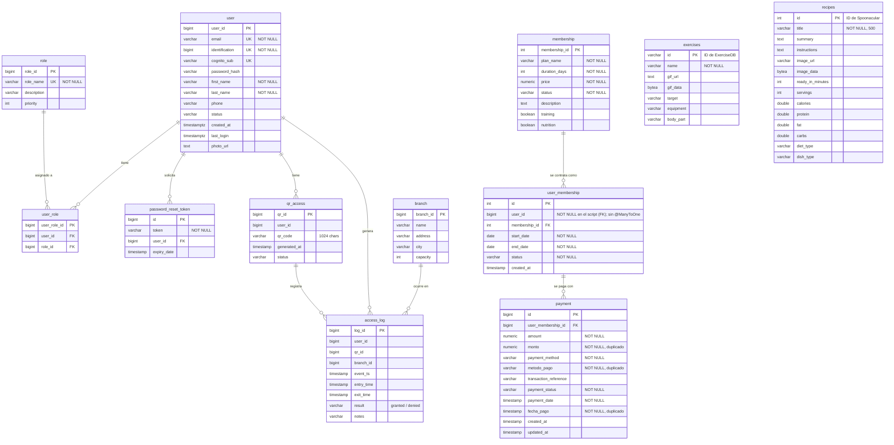

# 06 — Datos

> Estructura de la base de datos, entidades, relaciones y diccionario de campos.

## Documentos de esta sección

| Documento | Contenido |
|-----------|-----------|
| [`modelo-de-datos.md`](./modelo-de-datos.md) | Diagrama entidad-relación y detalle de las 12 tablas |
| [`diccionario-de-datos.md`](./diccionario-de-datos.md) | Campo por campo: tipo, nullable, restricción y ejemplo |

---

## Resumen de la base

| Aspecto | Valor |
|---------|-------|
| **Motor** | PostgreSQL 15 |
| **Base de datos** | `gymdb` |
| **Tablas** | 12 |
| **Entidades JPA** | 13 (una tabla, `user`, tiene dos entidades que la mapean) |
| **Servicio propietario** | Ninguno — los tres comparten la base (ver [ADR-002](../05-arquitectura/decisiones/registros/ADR-002-base-datos-compartida.md)) |
| **Migraciones** | ⚠️ Ninguna. `ddl-auto: update` en desarrollo. En producción, `validate` **solo** existe en GYMETR-login (perfil `prod`, `application-prod.properties`); Membership y QR no declaran ese perfil y mantienen `update` |

---

## Las 12 tablas

| # | Tabla | Pertenece a | Filas típicas | Contenido |
|---|-------|-------------|---------------|-----------|
| 1 | `"user"` | `GYMETR-login` | socios + admins | Identidad, credenciales, perfil |
| 2 | `role` | `GYMETR-login` | 2-4 | Roles: `Admin`, `Client` |
| 3 | `user_role` | `GYMETR-login` | N | Tabla puente usuario ↔ rol |
| 4 | `password_reset_token` | `GYMETR-login` | 0 | Tokens de recuperación, expiran a 15 min |
| 5 | `membership` | `GYMETR-Membership` | 3-5 | Catálogo de planes |
| 6 | `user_membership` | `GYMETR-Membership` | N | Suscripciones de socios a planes |
| 7 | `payment` | `GYMETR-Membership` | N | Pagos (Stripe) |
| 8 | `qr_access` | `GYMETRA-Qr` | N | Códigos QR por socio, vigencia 12 h |
| 9 | `access_log` | `GYMETRA-Qr` | **muy alto** | Entradas y salidas, la tabla que más crece |
| 10 | `branch` | `GYMETRA-Qr` | 1-5 | Sedes del gimnasio |
| 11 | `exercises` | `GYMETRA-Qr` | ~1.300 | Catálogo de ejercicios (sincronizado) |
| 12 | `recipes` | `GYMETRA-Qr` | ~500 | Recetas (sincronizado) |

---

## Diagrama entidad-relación

> **Nota sobre el diagrama:** las relaciones punteadas hacia `user` desde `user_membership`,
> `qr_access` y `access_log` existen como clave foránea **solo si la base la creó el script
> SQL** (con `ON DELETE CASCADE`); las entidades JPA no las mapean (sin `@ManyToOne`). Con
> `ddl-auto: update` sobre una base vacía, son columnas sueltas. Ver H-01 y el resumen de
> claves foráneas en [modelo-de-datos.md](./modelo-de-datos.md).

---

## Hallazgos del modelo de datos

Estos no son errores de estilo: son problemas que afectan a la integridad de los datos.

### 🔴 H-01 — `user_membership.user_id` sin relación JPA (la FK depende de quién creó la base)

`UserMembership` declara `@Column(name = "user_id")` con tipo `Integer`, **no** una relación
`@ManyToOne` a `User`. Consecuencias:

- Si la base la creó el script `database_ Initial.sql`, la FK **sí existe**
  (`ON DELETE CASCADE` hacia `user`) y el borrado propaga; si la creó Hibernate con
  `ddl-auto: update`, **no hay ninguna FK** y el borrado de un usuario deja membresías
  huérfanas. El comportamiento real depende de R-12 y R-22.
- En ningún caso el código valida la referencia: JPA no conoce la relación, así que una
  membresía con `user_id` inexistente se puede insertar desde el servicio.
- El tipo `Integer` no coincide con el `Long` de `user.user_id`. Con más de 2.147.483.647
  socios, el valor se truncaría. No es un riesgo real hoy, pero es una inconsistencia
  latente.

### 🔴 H-02 — `payment` tiene tres columnas duplicadas

| Canónica | Legacy | Sincronización |
|----------|--------|----------------|
| `amount` | `monto` | `@PrePersist` copia `amount` → `monto` |
| `payment_date` | `fecha_pago` | `@PrePersist` copia `payment_date` → `fecha_pago` |
| `payment_method` | `metodo_pago` | `@PrePersist` copia `paymentMethod.name()` → `metodoPago` |

El código lo documenta como "compatibilidad legacy". Funciona en la inserción, pero
`@PreUpdate` **solo actualiza `updated_at`**: si `amount` cambia después de insertar,
`monto` queda desincronizado. Hoy el importe no se modifica, así que no se manifiesta.

### 🟠 H-03 — `user` está mapeada por dos entidades

`GYMETR-login` mapea la tabla `"user"` con la entidad `User` (13 campos) y
`GYMETRA-Qr` la mapea con `UserMin` (solo `user_id`, `cognito_sub`, `email`). Dos entidades
JPA sobre la misma tabla, en dos procesos distintos, con esquemas de campos distintos.
Funciona, pero cualquier cambio de esquema en `user` tiene que hacerse con cuidado en los
dos servicios, y nada lo comprueba.

### ✅ H-04 — Nombres de columna: verificado, sin impacto en la base

| Campo | Columna real (PostgreSQL) | Estado |
|-------|---------------------------|--------|
| `Exercise.gifUrl` | `gif_url` | ✅ snake_case, sin `@Column(name=...)` explícito |
| `Recipe.imageUrl` | `image_url` | ✅ ídem |
| `Recipe.dietType` | `diet_type` | ✅ ídem |
| `Recipe.readyInMinutes` | `ready_in_minutes` | ✅ ídem |
| `UserMembership.userId` | `user_id` | ✅ snake_case; sin `@ManyToOne` (ver H-01) |

Los campos Java sí se declaran en camelCase (`gifUrl`, `imageUrl`, `readyInMinutes`,
`dietType`) y no llevan `@Column(name=...)`, pero Spring Boot 3 aplica
`CamelCaseToUnderscoresNamingStrategy`, así que Hibernate los crea en snake_case:
**no hay infracción de convención en la base**. Prueba en el código:
`RecipeRepository` usa SQL nativo con `WHERE diet_type ILIKE ...` y funciona.

El problema real es de otra naturaleza: los nombres camelCase solo son visibles en la
entidad y en el JSON de la API, el hecho no estaba documentado y quien lea la base
directamente no lo puede deducir de la entidad. No afecta a las consultas SQL escritas a
mano.

### 🟠 H-05 — `access_log` sin índices declarados en la entidad

`access_log` es la tabla que más crece (una fila por cada entrada y cada salida). La entidad
no declara índices, más allá del `PRIMARY KEY`; el script sí crea
`idx_access_log_user_time (user_id, access_time)`, pero **solo si la base la creó el
script**. Las consultas del historial (`GET /api/access-log`,
`GET /api/qr-access/all/{userId}`) filtran por `user_id`, `qr_id` y rango de fechas. Si no
existe el índice, PostgreSQL hará un **seq scan** sobre toda la tabla en cada consulta. A
partir de unos cientos de miles de registros, el historial se vuelve lento. Nota: el índice
del script no cubre `qr_id`, columna que además solo existe en la entidad.

### 🟠 H-06 — `password_reset_token` no declara índice ni limpieza

La tabla almacena tokens con `expiry_date` de 15 minutos. La entidad no declara índice sobre
`token` (si la base la creó Hibernate, la búsqueda es seq scan; si la creó el script, sí hay
`UNIQUE(token)`), y no existe ninguna tarea programada que llame al método de limpieza
`deleteAllExpiredSince` del repositorio. La tabla crece de forma indefinida.

### 🟡 H-07 — Tipo `bytea` para GIFs e imágenes

`exercises.gif_data` y `recipes.image_data` almacenan el binario completo de cada GIF (~1.300
archivos) y cada imagen (~500 archivos) **en la base de datos**. Esto:

- Multiplica el tamaño de la base y de los backups.
- Hace que el `pg_dump` diario sea pesado.
- Mezcla datos de catálogo (que se sincronizan desde una API externa y se pueden
  re-descargar) con datos de negocio (que no se pueden recuperar).
- Impide cachear en CDN las imágenes, que es lo natural para contenido estático.

La alternativa habitual es guardar la URL y servir el binario desde un object store
(S3, MinIO).

### 🔴 H-08 — Los intentos denegados no se registran en `access_log`

Aunque la columna `result` acepta `denied`, el flujo de validación devuelve `403` **antes** de
insertar en `access_log`. En la práctica solo se guardan accesos concedidos: no hay forma de
detectar el abuso de un QR robado ni de auditar por qué un socio no pudo entrar. El detalle
está en [`modelo-de-datos.md`](./modelo-de-datos.md) (sección 9) y es el riesgo R-14.

### 🟡 H-09 — `branch.capacity` sin usar

El campo `capacity` existe, pero **no hay ninguna regla de negocio que lo valide** frente
al número de accesses concurrentes en la sede. Es un campo decorativo hasta que se defina
la regla. Ver R-11.

---

## Esquema de sincronización

| Tabla | Origen | Cuándo | Idempotente |
|-------|--------|--------|-------------|
| `exercises` | ExerciseDB (RapidAPI) | Al arrancar, si hay menos de 1.300 filas. Semanal, domingos 03:00. Y a mano | ⚠️ Parcial |
| `recipes` | Spoonacular | Al arrancar, si la tabla está vacía. Semanal, domingos 04:00. Y a mano | ⚠️ Parcial |

> ⚠️ **La sincronización depende de APIs externas con cuota.** Si ExerciseDB o Spoonacular
> fallan o agotan la cuota, la base queda vacía o incompleta. `TranslationService` ya
> contempla el caso: registra `MYMEMORY WARNING: YOU USED ALL YOUR FREE QUOTA` y
> **conserva el término en inglés** en lugar de fallar. Ver R-27.

---

## Documentos relacionados

- [`modelo-de-datos.md`](./modelo-de-datos.md) — detalle completo por tabla
- [`diccionario-de-datos.md`](./diccionario-de-datos.md) — campo por campo
- [`../02-dominio/entidades-y-reglas.md`](../02-dominio/entidades-y-reglas.md) — reglas de negocio
- [`../05-arquitectura/decisiones/registros/ADR-002-base-datos-compartida.md`](../05-arquitectura/decisiones/registros/ADR-002-base-datos-compartida.md) — por qué una sola base
- [`../05-arquitectura/decisiones/registros/ADR-005-base-datos-postgresql.md`](../05-arquitectura/decisiones/registros/ADR-005-base-datos-postgresql.md) — por qué PostgreSQL
- [`../15-control-proyecto/riesgos.md`](../15-control-proyecto/riesgos.md) — riesgos derivados
