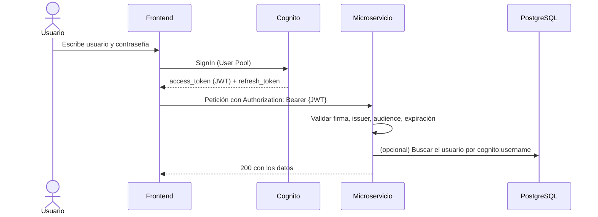
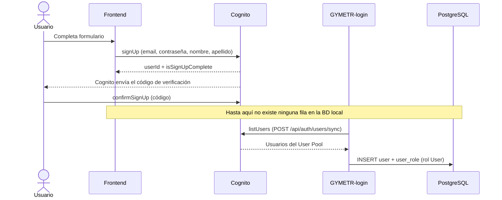
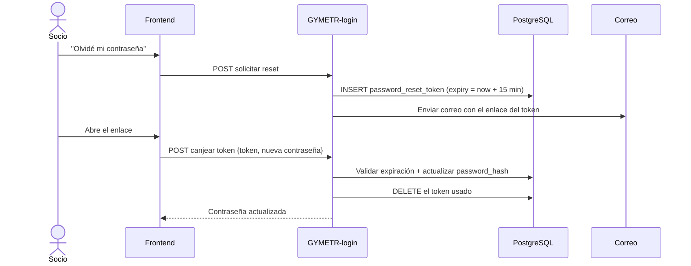

# Autenticación y autorización

> Cómo se verifica quién llama a la API y qué puede hacer.

## Resumen en una frase

GYMETRA usa **JWT stateless emitidos por AWS Cognito**: el frontend se autentica en Cognito,
recibe un token, y lo envía en cada petición a los tres servicios, que validan la firma
localmente sin volver a llamar a Cognito.

---

## 1. El flujo completo



**Punto clave:** el servicio **no** llama a Cognito en cada petición. Valida la firma del
JWT con la clave pública del User Pool, que se puede cachear. Eso es lo que hace que la
autenticación sea *stateless* y que QR no dependa de que Login esté disponible para validar
un token.

---

## 2. Flujo de registro

El registro es el punto más delicado, porque coordina tres sistemas:



> 🔴 **No hay endpoint de alta de socios.** El registro ocurre íntegramente contra Cognito
> desde el navegador; la fila en `user` nace después, cuando alguien ejecuta
> `POST /api/auth/users/sync`, que escanea el User Pool e importa a quien falte. Entre el
> registro y el `sync` el socio **no existe en la base local** y no puede contratar membresía.
> El rol que asigna la sincronización es `User`, no `Client`. Ver R-21.

> ⚠️ El frontend llama a Cognito **directamente desde el navegador**. Eso implica que
> `aws_cognito_domain` y `aws_cognito_client_id` están en el bundle de Vite. No son
> secretos por diseño en Cognito, pero obliga a configurar con cuidado el User Pool Client,
> que hoy tiene habilitados `ALLOW_ADMIN_USER_PASSWORD_AUTH` y `ALLOW_USER_PASSWORD_AUTH`.

---

## 3. Validación del token

Cada microservicio implementa la validación en su `SecurityConfig` con Spring Security como
Resource Server:

| Elemento | Valor |
|----------|-------|
| Tipo de token | JWT (RS256) |
| Emisor | `https://cognito-idp.<region>.amazonaws.com/<userPoolId>` |
| Audiencia | El `client_id` de la app |
| Claim de identidad | `cognito:username` (contiene el ID interno de GYMETRA) |
| Claim de roles | `cognito:groups` → traducido a `ROLE_*` |

**La conversión de roles** ocurre en `SecurityConfig.jwtAuthenticationConverter()`:

```java
// Un grupo de Cognito "Admin" se convierte en la authority "ROLE_Admin"
JwtGrantedAuthoritiesConverter → claim "cognito:groups"
    → prefija con "ROLE_"
    → Spring Security lo expone como @PreAuthorize("hasRole('Admin')")
```

> ⚠️ **Los roles de Cognito y los de la base de datos son dos fuentes de verdad.** Un
> usuario puede tener `Client` en la tabla `user_role` y `Admin` en su grupo de Cognito. En
> ese caso, Spring Security le concede permisos de admin aunque la base diga que es cliente
> normal. Ver la sección 5.

---

## 4. Endpoints públicos

Tres servicios, tres políticas distintas. Ninguno de los tres es Wrong, pero la inconsistencia
debería documentarse.

### `GYMETR-login` — 0 endpoints funcionales abiertos

```java
.requestMatchers("/public/**", "/v3/api-docs/**", "/swagger-ui/**",
                 "/swagger-ui.html").permitAll()
.anyRequest().authenticated()
```

Todos los endpoints de negocio requieren token. Los únicos abiertos son la documentación y
la carpeta `/public/**` (que no existe en el código).

### `GYMETR-Membership` — 2 endpoints funcionales abiertos

```java
.requestMatchers("/public/**",
                 "/api/memberships/available",                    // planes públicos
                 "/api/user-memberships/user/*/permission/*",     // verificación de permiso
                 "/v3/api-docs/**", "/api-docs/**",
                 "/swagger-ui/**", "/swagger-ui.html").permitAll()
```

- `/api/memberships/available` está abierto **a propósito**: la pantalla de planes debe
  poder cargarse antes de que el socio inicie sesión.
- `/api/user-memberships/user/*/permission/*` está abierto porque **QR lo necesita** para
  validar el acceso sin propagar un token a máquina. Ver
  [ADR-006](../05-arquitectura/decisiones/registros/ADR-006-proxy-validacion-membresia.md).

> 🔴 **Consecuencia de abrir el endpoint de permisos:** cualquiera que conozca la URL puede
> consultar si un usuario cualquiera tiene un permiso concreto, sin autenticarse. Eso es una
> enumeración de datos de membresía. Además, QR lo usa internamente, así que el
> "ataque" es trivial.

### `GYMETRA-Qr` — 16 endpoints abiertos

Son los 12 endpoints de `/api/exercises/**` más los 4 de `/api/nutrition/**`. **18 es el
total del sistema** (los 16 de QR más los 2 de Membership), no el de este servicio.

```java
.requestMatchers("/public/**",
                 "/v3/api-docs/**", "/api-docs/**",
                 "/swagger-ui/**", "/swagger-ui.html",
                 "/api/exercises/**",    // TODO el catálogo de ejercicios
                 "/api/nutrition/**"     // TODO el módulo de nutrición
                 ).permitAll()
```

- El catálogo de ejercicios y las recetas son de consulta pública, lo cual es razonable para
  contenido de lectura.
- **Pero el patrón `/**` abre también los endpoints de escritura:** `POST
  /api/exercises/sync/force`, `POST /api/exercises/sync/clear-and-force` y `POST
  /api/nutrition/sync`. Ese es el origen del riesgo R-19.

> 🔴 **Corrección recomendada:** cambiar los comodines por rutas exactas, de modo que solo
> los `GET` de lectura queden abiertos y las operaciones de escritura exijan token:
> ```java
> .requestMatchers(HttpMethod.GET, "/api/exercises/**", "/api/nutrition/**").permitAll()
> .requestMatchers("/api/exercises/sync/**", "/api/nutrition/sync").authenticated()
> ```

---

## 5. Doble fuente de verdad de los roles

| Fuente | Dónde vive | Para qué sirve |
|--------|-----------|----------------|
| Grupo de Cognito | User Pool, claim `cognito:groups` | Autorización de Spring Security (`@PreAuthorize`) |
| Tabla `user_role` | `gymdb` | Lógica de negocio, la interfaz de admin, asignación de roles |

Estas dos pueden **desincronizarse**:

- Un admin quita `Admin` de `user_role`, pero el usuario sigue en el grupo `Admin` de
  Cognito → **conserva permisos de administrador**.
- Un admin asigna `Admin` en `user_role`, pero el usuario no está en el grupo de Cognito →
  Spring Security no le concede permisos aunque la base diga que es admin.

**Recomendación:** elegir una fuente de verdad. Lo más simple es que la **base de datos sea
la autoridad** y que el token solo porte la identidad, con los roles resueltos en cada
petición (o cacheados con invalidación). Es lo que ya hace `RoleController` al exponer el
CRUD de roles, aunque hoy ese CRUD no se refleja en los grupos de Cognito.

---

## 6. Recuperación de contraseña

🔴 **No existe.** No hay ningún endpoint de solicitud ni de canje, ni servicio que use
`PasswordResetToken`. La entidad y el repositorio están declarados, pero son código muerto.

El siguiente diagrama describe el flujo **previsto** en el modelo de datos, no el
implementado. Ninguna de estas flechas ocurre hoy.



- El token expiraría a los **15 minutos**.
- Se eliminaría tras canjearse (uso único).
- La contraseña se almacenaría hasheada. 🔴 Hoy ni siquiera eso: `password_hash` no se escribe.

> 🔴 **Aunque se implementara tal cual, el flujo no funcionaría.** La autenticación la resuelve
> por completo Cognito, así que cambiar `password_hash` en la base local no alteraría la
> contraseña con la que el usuario inicia sesión. El reseteo debe llamar a la API de Cognito
> (`AdminSetUserPassword`), no a la base de datos. Hoy el único modo de recuperar una contraseña
> es entrar en la consola de AWS. Ver R-20 y R-26.

---

## 7. Autorización por rol

| Rol | Puede |
|-----|-------|
| `Client` | Ver sus datos, su QR, sus rutinas, su plan nutricional, pagar |
| `Admin` | Todo lo anterior + gestionar usuarios, roles, pagos, métricas, sedes |

La autorización por rol **debería** aplicarse con `@PreAuthorize` en los controladores, pero
**no hay ni una sola anotación `@PreAuthorize` ni `hasRole` en todo el backend.**

> ⚠️ **La mayoría de los endpoints de administración no declaran `@PreAuthorize` con un rol
> concreto.** Requieren autenticación (`anyRequest().authenticated()`), pero no exigen rol
> `Admin`. Es decir: **cualquier socio autenticado podría, en principio, llamar a
> `DELETE /api/auth/users/{userId}` o a `GET /api/payments/all`.** Es una de las
> consecuencias más graves de no haber unificado la política de autorización. Ver R-16.

---

## 8. Resumen de hallazgos de seguridad de la API

| # | Hallazgo | Impacto | Riesgo |
|---|----------|---------|--------|
| 1 | `POST /api/exercises/sync/clear-and-force` sin autenticación, borra todo el catálogo | 🔴 Crítico | R-19 |
| 2 | Endpoints de diagnóstico y `TableInspector` sin restricción de rol | 🔴 Alto | R-18 |
| 3 | Autorización solo por "autenticado", sin exigir rol `Admin` en la mayoría de la administración | 🔴 Alto | R-16 |
| 4 | Endpoint de verificación de permisos público: enumeración de membresías | 🟠 Medio | R-18 |
| 5 | Roles duplicados entre Cognito y base de datos | 🟠 Medio | R-16 |
| 6 | Documentación Swagger pública en los tres servicios | 🟡 Bajo | R-18 |
| 7 | Sin rate limiting en endpoints públicos | 🟡 Bajo | R-19 |

---

## Documentos relacionados

- [`README.md`](./README.md) — inventario de endpoints
- [`directrices-api.md`](./directrices-api.md) — convenciones de diseño
- [`../00-gobernanza/reglas-de-seguridad.md`](../00-gobernanza/reglas-de-seguridad.md) — reglas de seguridad
- [`../05-arquitectura/decisiones/registros/ADR-003-autenticacion-cognito.md`](../05-arquitectura/decisiones/registros/ADR-003-autenticacion-cognito.md) — por qué Cognito
- [`../15-control-proyecto/riesgos.md`](../15-control-proyecto/riesgos.md) — riesgos de seguridad
