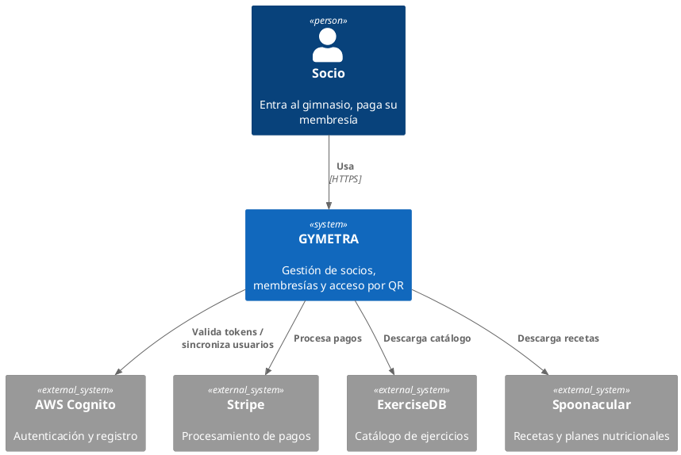
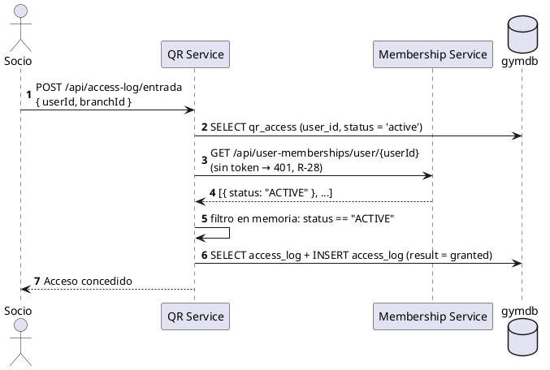
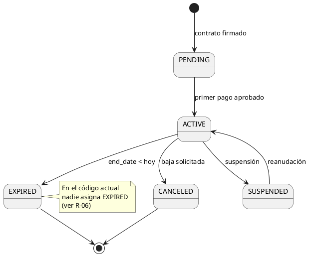
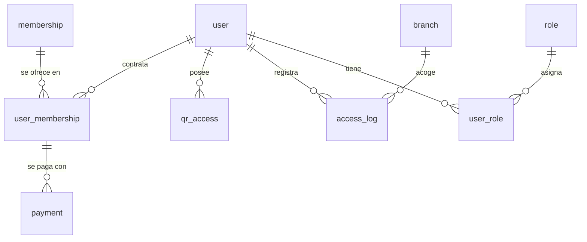

# Índice de diagramas

> Registro de todos los diagramas de GYMETRA. Antes de crear un diagrama nuevo, verificar si ya
> existe uno que responda la misma pregunta.

---

## ¿Cuándo crear un diagrama?

Se crea un diagrama cuando:

- Una explicación verbal requiere más de cinco minutos.
- La misma pregunta se hace más de dos veces.
- La documentación de texto quedó atrás del código.

No se crea un diagrama cuando:

- Se puede expresar en una tabla de dos filas.
- Solo sirve para mostrar lo obvio.
- Nadie más lo va a leer.

**Regla de fecha:** un diagrama sin fecha de última actualización se considera vencido. Un
diagrama que ya no refleja el código es Documento Muerto, con el riesgo de que alguien lo cite
como verdad.

---

## Nombres de archivo

```
NN-diagrama-<tipo>.png          → exportado, para documentación
NN-diagrama-<tipo>.puml         → fuente editable
```

| Prefijo | Tipo | Qué responde |
|---------|------|--------------|
| `NN-diagrama-contexto` | C4-N1 | ¿Con qué sistemas externos hablamos? |
| `NN-diagrama-contenedor` | C4-N2 | ¿Qué aplicaciones componen el sistema? |
| `NN-diagrama-componente` | C4-N3 | ¿Qué hay dentro de un servicio? |
| `NN-diagrama-clases` | Modelo | ¿Qué clases y métodos existen? |
| `NN-diagrama-entidad-relacion` | Datos | ¿Qué tablas hay y cómo se relacionan? |
| `NN-diagrama-secuencia` | Comportamiento | ¿En qué orden viajan los mensajes? |
| `NN-diagrama-estados` | Comportamiento | ¿En qué estados está una entidad? |
| `NN-diagrama-casos-de-uso` | Comportamiento | ¿Qué puede hacer cada actor? |
| `NN-diagrama-despliegue` | Infraestructura | ¿Dónde corre cada pieza? |
| `NN-diagrama-paquetes` | Arquitectura | ¿Cómo se organizan las dependencias? |

---

## Registro de diagramas

### Diagramas de arquitectura

| # | Diagrama | Fuente | Exportado | Estado |
|---|----------|--------|-----------|--------|
| 06 | Diagrama de paquetes | [`diagramas/fuente/06-diagrama-paquetes.puml`](diagramas/fuente/06-diagrama-paquetes.puml) | [`diagramas/exportados/06-diagrama-paquetes.png`](diagramas/exportados/06-diagrama-paquetes.png) | ✅ Verificado contra el código |
| — | C4 Nivel 1 — Contexto | [`diagramas/fuente/c4-contexto.puml`](diagramas/fuente/c4-contexto.puml) | [`diagramas/exportados/c4-contexto.png`](diagramas/exportados/c4-contexto.png) | ✅ Verificado contra el código |

### Diagramas de comportamiento

| # | Diagrama | Fuente | Exportado | Estado |
|---|----------|--------|-----------|--------|
| 01 | Diagrama de clases | [`diagramas/fuente/01-diagrama-clases.puml`](diagramas/fuente/01-diagrama-clases.puml) | [`diagramas/exportados/01-diagrama-clases.png`](diagramas/exportados/01-diagrama-clases.png) | ✅ Verificado contra el código; PNG pendiente de regenerar |
| 03a | Diagrama de secuencia A — Acceso por QR | [`diagramas/fuente/03-diagrama-secuencia.puml`](diagramas/fuente/03-diagrama-secuencia.puml) | [`diagramas/exportados/03-diagrama-secuencia.png`](diagramas/exportados/03-diagrama-secuencia.png) | ✅ Verificado contra el código |
| 03b | Secuencia B — Registro y primer inicio de sesión | [`diagramas/fuente/03-diagrama-secuencia.puml`](diagramas/fuente/03-diagrama-secuencia.puml) | [`diagramas/exportados/03-diagrama-secuencia_001.png`](diagramas/exportados/03-diagrama-secuencia_001.png) | ✅ Verificado contra el código |
| 03c | Secuencia C — Sincronización del catálogo de ejercicios | [`diagramas/fuente/03-diagrama-secuencia.puml`](diagramas/fuente/03-diagrama-secuencia.puml) | [`diagramas/exportados/03-diagrama-secuencia_002.png`](diagramas/exportados/03-diagrama-secuencia_002.png) | ✅ Verificado contra el código |
| 04 | Diagrama de casos de uso | [`diagramas/fuente/04-diagrama-casos-de-uso.puml`](diagramas/fuente/04-diagrama-casos-de-uso.puml) | [`diagramas/exportados/04-diagrama-casos-de-uso.png`](diagramas/exportados/04-diagrama-casos-de-uso.png) | ✅ Verificado contra el código |
| — | Estados de la membresía | [`diagramas/fuente/estados-membresia.puml`](diagramas/fuente/estados-membresia.puml) | [`diagramas/exportados/estados-membresia.png`](diagramas/exportados/estados-membresia.png) | ✅ Verificado contra el código; PNG pendiente de regenerar |

### Diagramas de datos

| # | Diagrama | Fuente | Exportado | Estado |
|---|----------|--------|-----------|--------|
| 02 | Diagrama entidad-relación | [`diagramas/fuente/02-diagrama-entidad-relacion.puml`](diagramas/fuente/02-diagrama-entidad-relacion.puml) | [`diagramas/exportados/02-diagrama-entidad-relacion.png`](diagramas/exportados/02-diagrama-entidad-relacion.png) | ✅ Verificado contra el script SQL; PNG pendiente de regenerar |

### Diagramas de infraestructura

| # | Diagrama | Fuente | Exportado | Estado |
|---|----------|--------|-----------|--------|
| 05 | Diagrama de despliegue | [`diagramas/fuente/05-diagrama-despliegue.puml`](diagramas/fuente/05-diagrama-despliegue.puml) | [`diagramas/exportados/05-diagrama-despliegue.png`](diagramas/exportados/05-diagrama-despliegue.png) | ✅ Verificado contra `docker-compose.yml` |
| — | C4 Nivel 2 — Contenedor | [`diagramas/fuente/c4-contenedor.puml`](diagramas/fuente/c4-contenedor.puml) | [`diagramas/exportados/c4-contenedor.png`](diagramas/exportados/c4-contenedor.png) | ✅ Verificado contra el código |

> **Los 11 PNG se han regenerado desde estas fuentes** con PlantUML 1.2026.8 sobre JDK 17, sin
> errores de sintaxis.
>
> ⚠️ **Pendiente (2026-09-26):** `01-diagrama-clases.puml`, `02-diagrama-entidad-relacion.puml` y
> `estados-membresia.puml` se corrigieron contra el código y sus tres PNG todavía muestran la
> versión anterior: hay que volver a exportarlos con el mismo comando.
>
> `03-diagrama-secuencia.puml` contiene tres diagramas en un solo archivo (acceso por QR, registro y
> sincronización del catálogo), por eso al renderizar produce tres PNG. Los tres están registrados
> abajo.

---

## Plantillas de diagramas

### C4 Nivel 1 — Contexto (PlantUML)



### Diagrama de secuencia (PlantUML)



### Diagrama de estados (PlantUML)



### Diagrama entidad-relación (Mermaid)



---

## Herramientas y generación

```bash
# Renderizar todos los diagramas PlantUML
# -o es una ruta RELATIVA a la carpeta de la fuente, por eso ../exportados
plantuml diagramas/fuente/*.puml -tpng -o ../exportados

# O con Docker, sin instalar PlantUML localmente
docker run --rm -v $(pwd):/w plantuml/plantuml diagramas/fuente/*.puml -tpng -o ../exportados
```

> La segunda forma no funciona: la imagen oficial no acepta rutas con separadores de Windows como
> argumento de `-o`. Con Docker hay que usar la ruta interna de Linux, o copiar antes los `.puml`
> a un volumen. Con PlantUML local más JDK 17 el comando sí funciona, y es como se han
> generado los 11 PNG actuales.

| Extensión | Herramienta |
|-----------|-------------|
| `.puml` | [PlantUML](https://plantuml.com) — requiere Java |
| `.mmd` | Mermaid — se renderiza en GitHub sin herramientas |
| `.png` | Exportado; nunca se edita a mano |

---

## Correlaciones

| Sección | Relación |
|---------|----------|
| [`05-arquitectura/`](../05-arquitectura/README.md) | Los diagramas C4 reflejan las decisiones estructurales |
| [`06-datos/`](../06-datos/README.md) | El DER se contrasta con el diccionario de datos |
| [`07-api/`](../07-api/README.md) | Los diagramas de secuencia usan las rutas de `contratos/openapi/` |
| [`12-ux-ui/`](../12-ux-ui/README.md) | Cada caso de uso tiene una pantalla asociada |
| [`15-control-proyecto/riesgos.md`](../15-control-proyecto/riesgos.md) | Los diagramas señalan los riesgos R-06, R-12 y R-19 |
