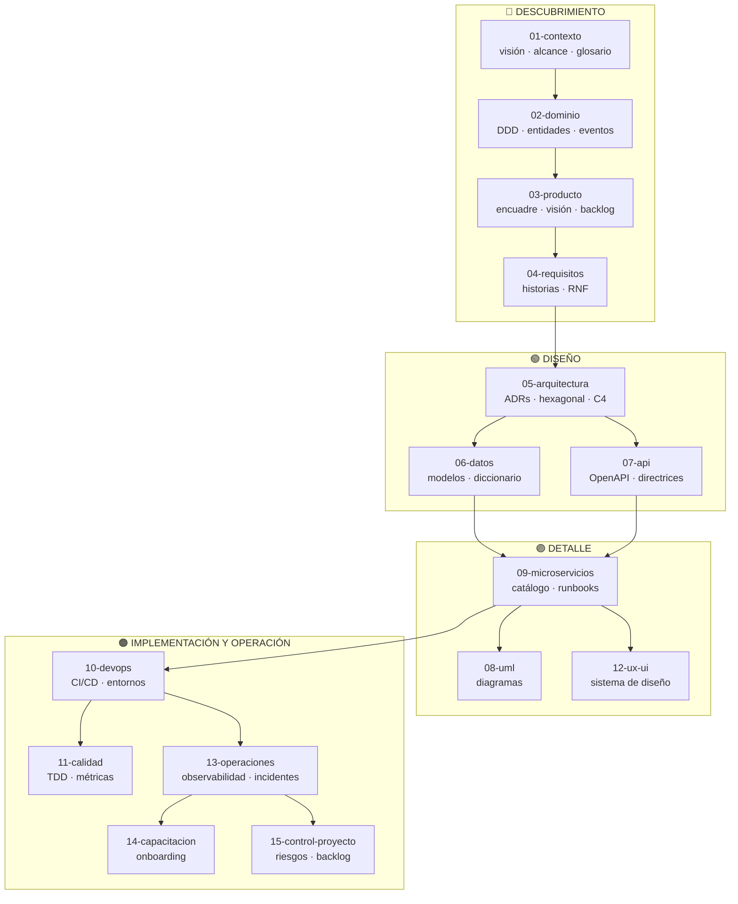
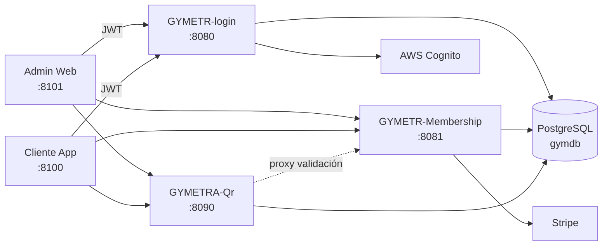

# Marco de Gobernanza de GYMETRA

> Documentación normativa y de diseño del sistema GYMETRA — Sistema de Gestión de
> Membresías de Gimnasio.
> Estructura derivada del *Microservices Governance Framework* de Jesús Ariel González Bonilla.

**Creador del proyecto:** Johan Sebastian Naranjo Quiroga — autor de GYMETRA y de este marco.

Este directorio es la **fuente de verdad** sobre cómo está diseñado y debe evolucionar
GYMETRA. No reemplaza a `doc/` (que conserva los entregables del proyecto y el registro
de software ante la DNDA), sino que lo **estructura y versiona** bajo un esquema formal.

---

## Regla de oro de la documentación

> **Un documento que nadie lee es un documento que no existe.**
>
> Antes de crear un documento pregúntate: ¿quién lo leerá? ¿cuándo? ¿qué decisión
> le ayuda a tomar? Si no puedes responder las tres, todavía no lo crees.

---

## Cómo usar este marco

1. **Lee [`00-guia-sdd.md`](./00-guia-sdd.md)** si eres nuevo en el proyecto. Explica la
   metodología completa, el orden de llenado y los gates de revisión.
2. **Lee el `README.md` de la sección** antes de tocar documentos dentro de ella.
   Cada README explica qué se documenta, por qué importa y qué preguntas responde.
3. **Verifica que el documento refleje el código real.** Un documento que contradice
   al código es una mentira, no documentación.
4. Cuando el código cambie y el documento no, **el documento está roto**.
   Quien abre el PR responsable del cambio de comportamiento actualiza la documentación.

---

## Flujo de construcción — dependencias entre secciones

> `00-gobernanza` envuelve todo el proyecto y aplica a cada sección.

---

## Índice de secciones

| # | Carpeta | Propósito | Fase |
|---|---------|-----------|------|
| 00 | [00-gobernanza](./00-gobernanza/README.md) | Reglas del equipo: Git, nomenclatura, DoD/DoR, seguridad | ⭐ Primero |
| 01 | [01-contexto](./01-contexto/README.md) | Por qué existe el sistema: visión, alcance, glosario | ⭐ Primero |
| 02 | [02-dominio](./02-dominio/README.md) | El problema de negocio: entidades, reglas, eventos | ⭐ Primero |
| 03 | [03-producto](./03-producto/README.md) | Qué construir: encuadre del problema, visión, backlog | ⭐ Primero |
| 04 | [04-requisitos](./04-requisitos/README.md) | Qué debe hacer el sistema: funcional y no funcional | ⭐ Primero |
| 05 | [05-arquitectura](./05-arquitectura/README.md) | Cómo se organiza el sistema: ADRs, despliegue, patrones | 🔵 Diseño |
| 06 | [06-datos](./06-datos/README.md) | Cómo se almacenan los datos: modelos, diccionario, propiedad | 🔵 Diseño |
| 07 | [07-api](./07-api/README.md) | Contratos de servicio: OpenAPI, autenticación, normas REST | 🔵 Diseño |
| 08 | [08-uml](./08-uml/README.md) | Diagramas: clases, secuencia, despliegue, casos de uso | 🔵 Diseño |
| 09 | [09-microservicios](./09-microservicios/README.md) | Cada servicio documentado individualmente | 🟢 Impl |
| 10 | [10-devops](./10-devops/README.md) | CI/CD, entornos, configuración local, despliegue | 🟢 Impl |
| 11 | [11-calidad](./11-calidad/README.md) | Estrategia de pruebas, TDD, revisión de código, métricas | 🟢 Impl |
| 12 | [12-ux-ui](./12-ux-ui/README.md) | Diseño de interfaz: sistema de diseño, flujos, mapas | 🔵 Diseño |
| 13 | [13-operaciones](./13-operaciones/README.md) | Operación en producción: observabilidad, incidentes, SLA/SLO | 🟠 Ops |
| 14 | [14-capacitacion](./14-capacitacion/README.md) | Manuales de usuario, guías de administración, onboarding | 🟠 Ops |
| 15 | [15-control-proyecto](./15-control-proyecto/README.md) | Riesgos, dependencias, preguntas abiertas, backlog técnico | 🔵 Diseño |
| 99 | [99-archivo](./99-archivo/README.md) | Decisiones y documentos obsoletos | — |

---

## Arquitectura del sistema en una mirada

**Servicios:** 3 microservicios Spring Boot + 2 aplicaciones Vue 3 / Ionic.
Detalle completo en [`09-microservicios/catalogo-de-servicios.md`](./09-microservicios/catalogo-de-servicios.md).

---

## Convenciones de nomenclatura

| Tipo de archivo | Patrón | Ejemplo |
|-----------------|--------|---------|
| Documentos de contenido | `kebab-case.md` | `mapa-de-dominio.md` |
| Plantillas | `_nombre-plantilla.md` (prefijo `_` para ordenar primero) | `_plantilla-adr.md` |
| ADRs | `ADR-NNN-titulo-corto.md` (numeración correlativa) | `ADR-003-autenticacion-cognito.md` |
| Contratos OpenAPI | `nombre-servicio.yaml` | `qr-service.yaml` |
| Carpetas de servicio | `NN-nombre-del-servicio/` | `01-gymetr-login/` |

**Regla de idioma:** ver [`ADR-001`](./05-arquitectura/decisiones/registros/ADR-001-idioma-documentacion.md).

---

## Dependencias cruzadas

| Si cambias... | También debes revisar... |
|---------------|--------------------------|
| El alcance (01-contexto) | Visión de producto (03), requisitos (04), arquitectura (05) |
| Una entidad de dominio (02) | Modelos de datos (06), contratos API (07), diagramas (08) |
| Un requisito funcional (04) | Criterios de aceptación, casos de prueba (11) |
| La arquitectura (05) | Los ADRs, cada microservicio afectado (09) |
| Un modelo de datos (06) | Servicio propietario del contrato (07, 09), diagrama ER (08) |
| Un contrato API (07) | Microservicio propietario (09), consumidores (09) |
| Un microservicio (09) | Mapa de dependencias, catálogo de eventos, matriz de propiedad de datos |
| El pipeline CI/CD (10) | Checklist derelease (10), entornos (10) |

---

## Metodologías incluidas

| Metodología | Documento principal | Sección |
|-------------|---------------------|---------|
| **SDD** (Software Design Documentation) | [`00-guia-sdd.md`](./00-guia-sdd.md) | Raíz |
| **DDD** (Domain-Driven Design) | [`02-dominio/mapa-de-dominio.md`](./02-dominio/mapa-de-dominio.md) | 02-dominio |
| DDD — Entidades, VOs, agregados | [`02-dominio/entidades-y-reglas.md`](./02-dominio/entidades-y-reglas.md) | 02-dominio |
| DDD — Eventos de dominio | [`02-dominio/eventos-de-dominio.md`](./02-dominio/eventos-de-dominio.md) | 02-dominio |
| **Arquitectura Hexagonal** | [`05-arquitectura/arquitectura-hexagonal.md`](./05-arquitectura/arquitectura-hexagonal.md) | 05-arquitectura |
| **Patrones** (GoF + microservicios) | [`05-arquitectura/guia-de-patrones.md`](./05-arquitectura/guia-de-patrones.md) | 05-arquitectura |
| **TDD** (Test-Driven Development) | [`11-calidad/guia-tdd.md`](./11-calidad/guia-tdd.md) | 11-calidad |
| TDD — Estrategia y pirámide | [`11-calidad/estrategia-de-pruebas.md`](./11-calidad/estrategia-de-pruebas.md) | 11-calidad |

---

## Relación con el resto de `doc/`

Este directorio **convive** con los entregables del proyecto. No los reemplaza:

| Contenido previo | Dónde vive ahora |
|------------------|------------------|
| `doc/technical_specs/architecture.md` | → [`05-arquitectura/vision-general.md`](./05-arquitectura/vision-general.md) |
| `doc/technical_specs/requirements.md` | → [`04-requisitos/no-funcionales.md`](./04-requisitos/no-funcionales.md) y [`historias-de-usuario.md`](./04-requisitos/historias-de-usuario.md) |
| `doc/technical_specs/data_model.md` | → [`06-datos/modelo-de-datos.md`](./06-datos/modelo-de-datos.md) |
| `doc/technical_specs/api_documentation.md` | → [`07-api/contratos/openapi/`](./07-api/contratos/openapi/) |
| `doc/diagrams/*.png` | → [`08-uml/diagramas/exportados/`](./08-uml/diagramas/exportados/) |
| `doc/environments/*` | → [`10-devops/entornos.md`](./10-devops/entornos.md) |
| `doc/registration_documents/*` (DNDA) | Se mantiene en `doc/registration_documents/` — es un entregable oficial |
| `doc/manuals/*`, `doc/mockups/*` | Se mantiene en su ubicación — son entregables de usuario |

> **Nota sobre `data_model.md`:** la versión anterior difería del código real en tipos de
> clave primaria, campos inexistentes (`address`, `code`, `validated`) y omitía cinco
> entidades. La versión en `06-datos/modelo-de-datos.md` está verificada contra el código fuente.

---

## Recursos de referencia

- [adr.github.io](https://adr.github.io/) — Architecture Decision Records
- [12factor.net](https://12factor.net/) — Principios de aplicación
- [OpenAPI Specification](https://swagger.io/specification/) — Estándar de contratos REST
- [C4 Model](https://c4model.com/) — Diagramas de arquitectura
- [Domain-Driven Design Reference](https://www.domainlanguage.com/ddd/reference/) — Eric Evans
- [Hexagonal Architecture](https://alistair.cockburn.us/hexagonal-architecture/) — Alistair Cockburn
- [Test-Driven Development](https://www.amazon.com/Test-Driven-Development-Kent-Beck/dp/0321146530) — Kent Beck

---

## Licencia

Documentación del proyecto GYMETRA — Corporación Universitaria del Huila,
curso Sistemas Distribuidos (8° semestre).
