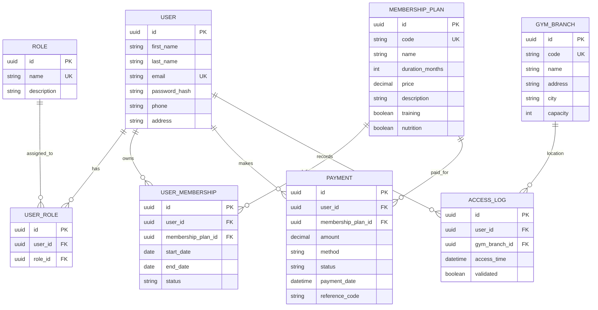

# Modelo de Datos (Entidad-Relación) - GYMETRA

## Descripción de Entidades

*   **USER**: Almacena la información de los socios y administradores.
*   **ROLE**: Define los permisos del sistema (ADMIN, CLIENT).
*   **MEMBERSHIP_PLAN**: Define los tipos de planes disponibles (Mensual, Trimestral, Anual, con/sin extras).
*   **USER_MEMBERSHIP**: Relaciona a los usuarios con sus planes actuales y periodos de vigencia.
*   **PAYMENT**: Registra las transacciones financieras.
*   **GYM_BRANCH**: Sedes físicas del gimnasio.
*   **ACCESS_LOG**: Auditoría de entradas y salidas para control de aforo y asistencia.
