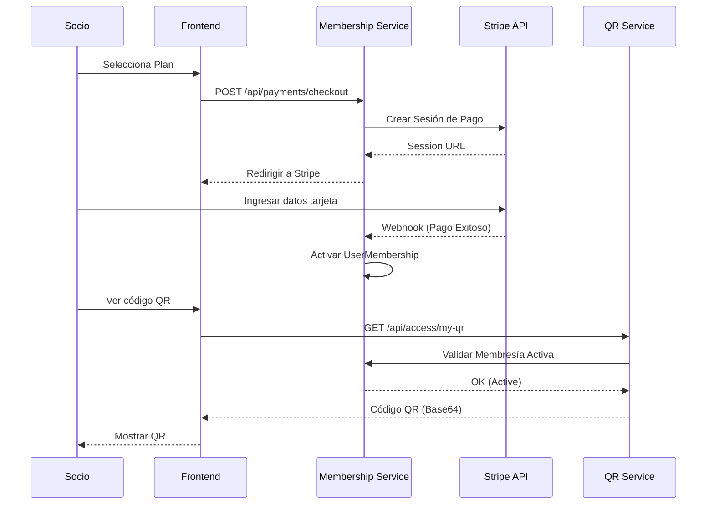

# Diagramas UML - GYMETRA

## 1. Diagrama de Casos de Uso

```mermaid
useCaseDiagram
    actor "Socio (Cliente)" as Socio
    actor "Administrador" as Admin
    actor "Sistema de Pagos" as Stripe

    package GYMETRA {
        usecase "Registrarse/Login" as UC1
        usecase "Comprar Membresía" as UC2
        usecase "Generar QR de Acceso" as UC3
        usecase "Ver Rutinas/Nutrición" as UC4
        usecase "Gestionar Usuarios" as UC5
        usecase "Gestionar Planes" as UC6
        usecase "Ver Reportes/Métricas" as UC7
        usecase "Validar Acceso" as UC8
    }

    Socio --> UC1
    Socio --> UC2
    Socio --> UC3
    Socio --> UC4

    Admin --> UC1
    Admin --> UC5
    Admin --> UC6
    Admin --> UC7
    Admin --> UC8

    UC2 -- Stripe : Procesar Pago
```

## 2. Diagrama de Secuencia: Proceso de Compra y Acceso


